# Stabilité au sens Lyapunov et méthode des Cycles-Limites

## Modèle Cinématique du robot

### Démonstration de la généralisation

En partant du modèle cinématique définit dans le cours (Partie II cours 1 page 46) : 

{width=60%}

Ce modèle est défini dans le repère global, or le papier utilise un repère de Frenet.

Matriciellement, la cinématique du robot unicycle est donnée par :

{width=60%}

Ce qui donne, en développant les matrices :

$$
\begin{cases}
\dot{x} = v \cos(\theta) - \omega(l_1 \sin(\theta) + l_2 \cos(\theta))
\dot{y} = v \sin(\theta) + \omega(l_1 \cos(\theta) - l_2 \sin(\theta))
\dot{\theta} = \omega
\end{cases}
$$


or, la deuxième partie des équations de x et y sont liées au décalage apporté par le repère de Frenet (qui dépends de l1, l'abscisse du point considéré, et l2, l'ordonnée du point considéré).

De ce fait, si on supperpose le point défini par (l1, l2) au point O', centre de l'entraxe de roue, on obtient :

$$
\begin{cases}
\dot{x} = v \cos(\theta) \\
\dot{y} = v \sin(\theta) \\
\dot{\theta} = \omega
\end{cases}
$$

Soit le modèle cinématique vu en cours.

### Modèle Simulink

{width=60%}

Voici un algorithme en pseudo-code expliquant les différentes étapes de la commande du robot :

```pseudocode
- Définition des commandes initiales (ultimement : perception)
- Définition du point cible
- Définition de la position des obstacles
- Définition du modèle du robot
- Instanciation des obstacles
- Simulation
- Affichage
```

Voici les étapes de la simulation :

```pseudocode
- Saturation des vitesses linéaires et angulaires
- Application au modèle cinématique
- Calcul de la commande à appliquer
- Feedback de la commande
```

Détail de la commande :

```pseudocode
- Calcul des obstacles potentiels
- Récupération de l'obstacle le plus proche
- S'il n'y a aucun obstacle potentiel, on se dirige vers le point cible (Commande d'attraction)
- Sinon, on calcule la trajectoire du robot pour éviter l'obstacle (Commande d'évitement)
```

## Synthèse de commande en utilisant le théorème de Lyapunov

### Preuve de la stabilité de la loi de commande

En partant du modèle cinématique suivant :

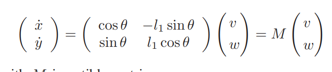{width=60%}

Ce modèle suppose que le point considéré du repère de Frenet se situe sur l'axe longitudinal du robot (l2 = 0).

La loi de commande est donc (algèbre matricielle linéaire) :

{width=60%}

Avec :

- $K$ : un gain de commande
- $M^{-1}$ : l'inverse de la matrice du modèle cinématique
- $e_x$ : l'erreur sur l'axe x, $x - x_T$
- $e_y$ : l'erreur sur l'axe y, $y - y_T$

En considérant la fonction de Lyapunov suivante :

$$
V_1 = \frac{1}{2} d^2 
$$
$$
V_1 = \frac{1}{2} ((x - x_T)^2 + (y - y_T)^2)
$$

Démontrons que cette fonction est positive :

- Les termes $(x - x_T)^2$ et $(y - y_T)^2$ sont toujours positifs (carré d'un nombre réel)
- La racine de la somme de ces termes est donc positive
- La multiplication par 1/2 ne change pas le signe de la fonction

De ce fait, la fonction de Lyapunov est positive.

En dérivant cette fonction, on obtient :

$$
V_1' = \frac{1}{2} \frac{d}{dt} e_x^2 + e_y^2
$$
$$
V_1' = \frac{1}{2} (2 e_x \dot{e_x} + 2 e_y \dot{e_y})
$$

Or, on connait les valeurs de $\dot{e_x}$ et $\dot{e_y}$ :

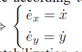{width=60%}

En remplaçant ces valeurs dans l'équation de $V_1'$, on obtient :

$$
V_1' = e_x \dot{x} + e_y \dot{y}
$$

Or, on connait aussi les valeurs de $\dot{x}$ et $\dot{y}$ :

$$
\begin{cases}
\dot{x} = v \cos(\theta) \\
\dot{y} = v \sin(\theta) \\
\dot{\theta} = \omega
\end{cases}
$$

En sachant que $v$ et $\dot{\theta} = \omega$ sont définies par le régulateur linéaire $-K.M^{-1}.\vec{e}$ :

$$
M^{-1} = \frac{1}{\cos{\theta}.l1.\cos{\theta} - l1.\sin{\theta}.\sin{\theta}} \begin{pmatrix}
l1.\cos{\theta} & l1.\sin{\theta} \\ 
-\sin{\theta} & \cos{\theta} 
\end{pmatrix} 
$$
$$
M^{-1} = \frac{1}{l1.\cos^2{\theta} - l1.\sin^2{\theta}} \begin{pmatrix}
l1.\cos{\theta} & l1.\sin{\theta} \\ 
-\sin{\theta} & \cos{\theta} 
\end{pmatrix} 
$$
$$
M^{-1} = \begin{pmatrix}
\frac{\cos{\theta}}{\cos^2{\theta} - \sin^2{\theta}} & \frac{\sin{\theta}}{\cos^2{\theta} - \sin^2{\theta}} \\ 
\frac{-\sin{\theta}}{l1.\cos^2{\theta} - l1.\sin^2{\theta}} & \frac{\cos{\theta}}{l1.\cos^2{\theta} - l1.\sin^2{\theta}}
\end{pmatrix} 
$$

On trouve donc : 

$$
\begin{cases}
v = -K.(\frac{\cos{\theta}}{\cos^2{\theta} - \sin^2{\theta}}.e_x + \frac{\sin{\theta}}{\cos^2{\theta} - \sin^2{\theta}}.e_y) \\
\omega = -K.(\frac{-\sin{\theta}}{l1.\cos^2{\theta} - l1.\sin^2{\theta}}.e_x + \frac{\cos{\theta}}{l1.\cos^2{\theta} - l1.\sin^2{\theta}}.e_y)
\end{cases} \\
$$
$$
\begin{cases}
v = -K.(\frac{\cos{\theta}}{\cos{2\theta}}.e_x + \frac{\sin{\theta}}{\cos{2\theta}}.e_y) \\
\omega = -K.(\frac{-\sin{\theta}}{l1.\cos{2\theta}}.e_x + \frac{\cos{\theta}}{l1.\cos{2\theta}}.e_y)
\end{cases}
$$

En remplaçant ces valeurs dans l'équation de $V_1'$, on obtient :

$$
V_1' = e_x.v.\cos{\theta} + e_y.v.\sin{\theta} 
$$
$$
V_1' = v.(e_x.\cos{\theta} + e_y.\sin{\theta}) 
$$
$$
V_1' = -K.(\frac{\cos{\theta}}{\cos{2\theta}}.e_x + \frac{\sin{\theta}}{\cos{2\theta}}.e_y).(e_x.\cos{\theta} + e_y.\sin{\theta}) 
$$
$$
V_1' = -K.\frac{\cos{\theta}}{\cos{2\theta}}.e_x(e_x.\cos{\theta} + e_y.\sin{\theta}) -K.\frac{\sin{\theta}}{\cos{2\theta}}.e_y(e_x.\cos{\theta} + e_y.\sin{\theta}) 
$$
$$
V_1' = -K.(\frac{\cos^2{\theta}.e_x + \cos{\theta}\sin{\theta}.e_y}{\cos{2\theta}}e_x +\frac{\sin{\theta}\cos{\theta}.e_x + \sin^2{\theta}.e_y}{\cos{2\theta}}e_y) 
$$
$$
= -K \frac{e_x^2.\cos^2{\theta} + e_x.e_y.\cos{\theta}\sin{\theta} + e_x.e_y.\cos{\theta}\sin{\theta} + e_y^2.\sin^2{\theta}}{\cos{2\theta}} 
$$
$$
= -K \frac{e_x^2.\cos^2{\theta} + 2.e_x.e_y.\cos{\theta}\sin{\theta} +e_y^2.\sin^2{\theta}}{\cos{2\theta}} 
$$
$$
= -K \frac{e_x^2.\cos^2{\theta} + e_x.e_y.\sin{2\theta} +e_y^2.\sin^2{\theta}}{\cos{2\theta}} 
$$

Preuve de la négativité de $V_1'$ :

- Les termes $e_x^2.\cos^2{\theta}$ et $e_y^2.\sin^2{\theta}$ sont toujours positifs
- Le signe dépends donc de $\frac{e_x.e_y.\sin{2\theta}}{\cos{2\theta}}$ = $e_x.e_y.\tan{2\theta}$


### Implémentation Matlab

Changements dans le code du fichier "CommandeAttraction.m" :

```matlab
K = [K1 0; 0 K2];
M = [cos(ThetaReel) -l1*sin(ThetaReel); sin(ThetaReel) l1*cos(ThetaReel)];
Commande = K * inv(M) * [Ex; Ey];
```

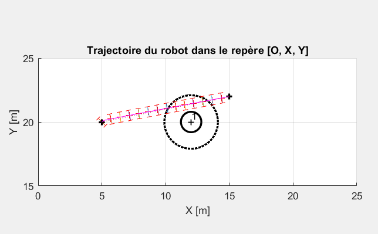{width=60%}

Le robot adapte bien sa trajectoire pour aller sur le point cible.

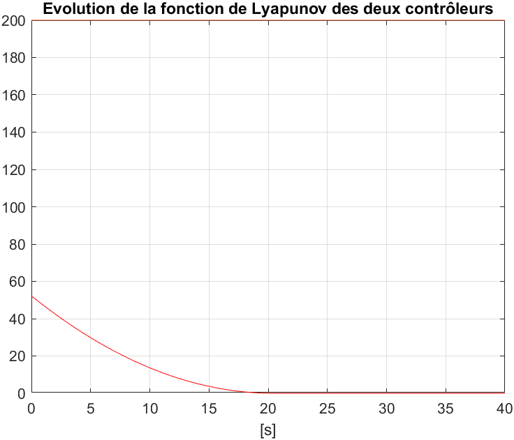{width=60%}

## Evitement d'obstacles avec la méthode des cycles limites

### Changements dans Matlab

__Matrice de changement de repère :__

```matlab
T_O_A = [cos(Alpha) -sin(Alpha) 0 X_D_O
              sin(Alpha) cos(Alpha)  0 Y_D_O
              0          0           1 0
              0          0           0 1    ]; 
```

__Trajectoire du robot :__

```matlab
if Y_Prime < 0 %%clock-wise
    X_dot = Yrelatif + Xrelatif*((RayonCycleLimite^2) - (Xrelatif^2) - (Yrelatif^2));
    Y_dot = -Xrelatif + Yrelatif*((RayonCycleLimite^2) - (Xrelatif^2) - (Yrelatif^2)); 
else %%counter-clockwise
    X_dot = -Yrelatif + Xrelatif*((RayonCycleLimite^2) - (Xrelatif^2) - (Yrelatif^2));
    Y_dot = Xrelatif + Yrelatif*((RayonCycleLimite^2) - (Xrelatif^2) - (Yrelatif^2));
end 
```

(La condition permet de gérer les sens de rotation)

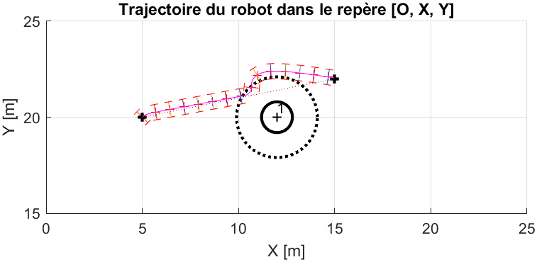{width=60%}

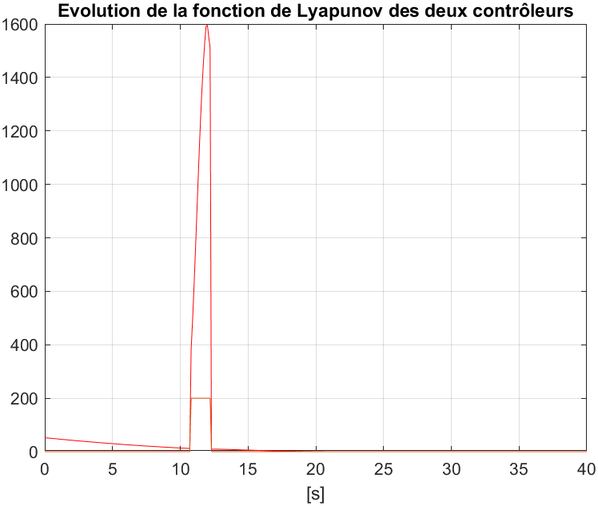{width=60%}

### Preuve de la stabilité de la loi de commande

On utilise la fonction de Lyapunov candidate suivante :

$$
V_2 = \frac{1}{2} \theta_e^2 \tag{11}
$$

Cette fonction de Lyapunov est choisie parce qu'elle est positive et quadratique, ce qui simplifie l'analyse de la stabilité.

On calcule la dérivée par rapport au temps de $V_2$ :

$$
\dot{V}_2 = \theta_e \cdot \dot{\theta}_e
$$

Ensuite, on remplace $\dot{\theta}_e$ par l'expression issue de la dynamique du système, qui est donnée par :

$$
\dot{\theta}_e = -K_p \theta_e \tag{10}
$$

En substituant cette expression dans l'équation de $\dot{V}_2$, on obtient :

$$
\dot{V}_2 = \theta_e \cdot (-K_p \theta_e)
$$

Ce qui se simplifie en :

$$
\dot{V}_2 = -K_p \theta_e^2
$$

Ici, $K_p$ est une constante positive. Par conséquent, $\dot{V}_2$ est toujours négatif ou nul car $\theta_e^2$ est toujours positif ou nul. Cela signifie que $V_2$ est une fonction décroissante du temps.

Parce que $V_2$ est bornée inférieurement par zéro et décroissante, selon le critère de stabilité de Lyapunov, cela implique que $V_2$ converge vers zéro à mesure que le temps tend vers l'infini. En d'autres termes, l'erreur $\theta_e$ converge vers 0, ce qui signifie que le système est stable et l'erreur est éliminée à long terme.

Ainsi, l'utilisation de cette fonction de Lyapunov démontre que l'erreur $\theta_e$ décroît et converge vers zéro, assurant la stabilité du système.

### Cas multi-obstacles

Pour faire fonctionner le cas multi-obstacles, il faut rajouter les lignes suivantes dans le code Matlab :

```matlab
if(isempty(RayonCycleLimite))
    RayonCycleLimite=GetRv(Obstacle(IndiceObstaclePlusProche))-0.3;
end
```

Cela permet de corriger un bug qui empêche le correcteur de récupérer le rayon de cycle limite de l'obstacle le plus proche.

Une fois cette correction effectuée, on peut activer l'exemple 2 dans le programme principal, ce qui donne les figures suivantes :

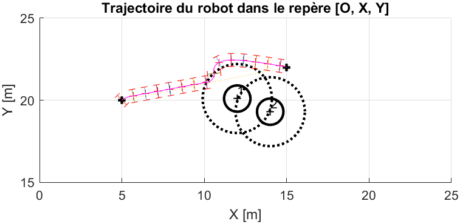{width=60%}

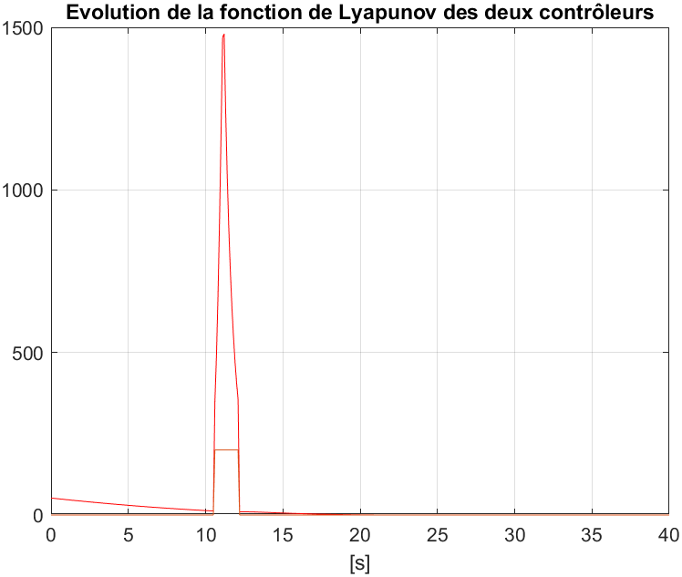{width=60%}

Cependant, si l'on déplace le point de destination, le robot ne réagit pas correctement :

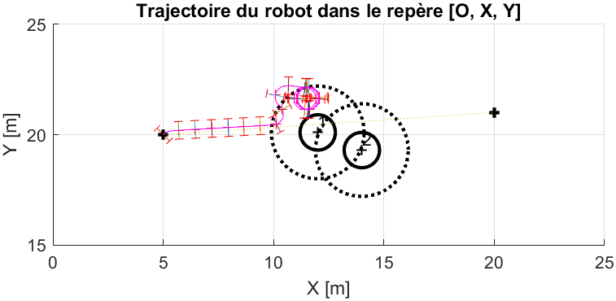{width=60%}

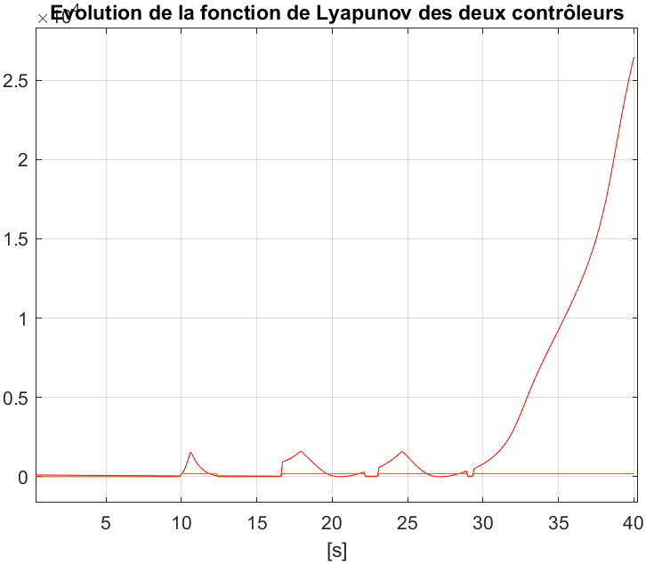{width=60%}

Le robot est coincé dans le disque de cycle limite du premier obstacle, et en dehors du disque du deuxième obstacle. Il ne peut donc pas se déplacer.

C'est un cas non géré par la simulation bien que prévu dans le papier de 2009 (_V. CONFLICTING SITUATIONS MANAGEMENT_, Cas (a))

## Conclusion

En conclusion, la méthode des cycles limites est une méthode efficace pour éviter les obstacles. Le robot est capable de se déplacer en évitant les obstacles, même en cas de multi-obstacles. Cependant, il reste des mécanismes à ajouter pour gérer les situations de conflit, comme le montre le cas du robot coincé entre deux obstacles.

Les preuves de stabilité de la loi de commande montrent que le système est stable et que l'erreur converge vers zéro à long terme. Cela assure le bon fonctionnement du robot et sa capacité à atteindre sa destination.

# Planification à Long Terme

__Pseudocode pour réaliser la planification à long-terme d'un robot mobile :__

```java
BEGIN LTP

INPUT:
- Initial configuration of the robot
- Environment configuration (obstacles and target)
- Parameters for PELC (µ, Kp)

INITIALIZE:
- Graph G = (V, E) where:
            - V: Set of vertices representing robot positions around obstacles and target
            - E: Set of edges representing PELC paths between vertices
- FOREACH obstacle:
						- Calculate PELC
						- Create vertices (position along the orbit)
						- Create edges between the vertices and the target
- FOREACH edge :
						- Calculate the cost
- SEARCH
						- use Dijkstra to find the shortest path
						OR
						- use A* algorithm to find the shortest path
						return optimal path
						
END LTP
```

## Optimisation du paramètre Mu

Le paramètre Mu est un paramètre de l'algorithme PELC qui permet de déterminer "l'attaque" du cycle-limite. Concrètement, une valeur faible de Mu permettra une convergence vers l'orbite plus lissée, alors qu'une valeur élevée de Mu permettra une convergence plus raide vers l'orbite (Se manifestant par un rayon de courbure plus petit à l'intersection de l'orbite et de la trajectoire).

Optimiser le paramètre $\mu$, revient à minimiser la fonction de coût générale[^1] du PELC. Cette fonction de coût est définie par :

$$
J = \omega_1 J_{\text{DistanceToPti}} + (1 - \omega_1) J_{\text{PELCLength}} + \omega_2 J_{\text{PELCCurvature}} + \omega_3 BOOL_{\text{MaximumCurvature}} + \omega_4 BOOL_{\text{Collision}}
$$

[^1]: _Local path generation based on PELC_, Robotics and Autonomous Systems, L. Adouane, 2017

Une solution numérique est aisément obtenue en utilisant un algorithme de recherche de type dichotomique, mais l'objet de l'exercice est de déterminer une solution analytique. C'est une opération non triviale, car la fonction de coût est non-linéaire et dépend de plusieurs paramètres.

### 1er essai : Minimisation Analytique

Pour obtenir $\mu^*$, c'est-à-dire la valeur optimale de $\mu$ qui minimise la fonction de coût $ JPELCLength $, on utilise la méthode du gradient. Cette méthode consiste à calculer la dérivée de la fonction de coût par rapport à $\mu$ et à ajuster $\mu$ dans le sens opposé au gradient jusqu'à ce que le minimum soit atteint.

__Étape 1 : Calcul de la dérivée partielle de $J$ par rapport à $\mu$__

La première opération à réaliser est le calcul de la dérivée de $J$ en fonction de $\mu$ :

$$
\frac{\partial J}{\partial \mu}
$$

Ce calcul n'est pas trivial, car il nécessite d'exprimer chacun des composants de la fonction de coût $J$ en fonction de $\mu$.

__Étape 2 : Analyse des composants influencés par $\mu$__

D'après les informations que nous avons (source RAS, L. Adouane) :

- Lorsque $\mu$ augmente :
  - La **courbure** (Curvature) augmente. Cela signifie qu'il y a une relation croissante entre $\mu$ et la courbure de la trajectoire ou du système.
  - La **DistancePti** diminue. Cette réduction est inversement proportionnelle à $\mu$ (à cause du terme $1 - \omega_1$, qui implique une dépendance inverse).

- La fonction $JPELCLength$ admet un minimum global pour une certaine valeur de $\mu$. Autrement dit, la longueur associée à ce coût (JPELCLength) n'est pas monotone en fonction de $\mu$, mais possède un point critique où la dérivée s'annule.

__Étape 3 : Minimisation de $JPELCLength$__

Les équations différentielles du PELC sont données par :

$$
\dot{x}_s = r y_s + \mu x_s (1 - \psi)
$$
$$
\dot{y}_s = -r x_s + \mu y_s (1 - \psi)
$$

Les termes $\mu x_s (1 - \psi)$ et $\mu y_s (1 - \psi)$ introduisent une non-linéarité dans le système.

C'est là que la difficulté réside. Il est nécessaire de déterminer une relation analytique entre $JPELCLength$ et $\mu$ pour pouvoir déterminer le minimum de cette fonction. Cela implique de déterminer les dérivées partielles de $JPELCLength$ par rapport à $\mu$ et de résoudre l'équation pour trouver le minimum.

Hors, le système régissant le PELC est non-linéaire. Il est donc difficile de déterminer une relation analytique entre $JPELCLength$ et $\mu$.

Une approche analytique n'est donc pas envisageable pour déterminer $\mu^*$.

###  2ème essai : Minimisation Numérique

Dans le TD, une optimisation dichotomique est utilisée pour déterminer $\mu^*$. Cette méthode consiste à déterminer un intervalle de recherche pour $\mu$, puis à diviser cet intervalle en deux parties égales et à déterminer dans quelle partie se trouve le minimum. On répète cette opération jusqu'à ce que l'intervalle de recherche soit suffisamment petit.

L'intervalle de recherche étant : [1, 10] et le nombre de points de recherche étant 3, on obtient :

[Min, (Min + Max) / 2, Max]

La recherche dichotomique est effectuée sur cet ensemble de valeurs de $\mu$ pour déterminer les nouvelles bornes de l'intervalle de recherche. 

On fait ensuite un nombre de 5 itérations sur cet intervalle pour déterminer la valeur optimale de $\mu$

Une fois de plus, l'intervalle de recherche est à trouver soit empiriquement, soit par une méthode numérique. Dans notre cas, nous avons pris l'intervalle qui nous semblait le plus adapté :

- \> 1 sinon les chemins sont de très longues courbes
- < 10 sinon les chemins sont trop abrupts (rayon de courbure très faible qui peut engendrer des souci dans la vie réelle)

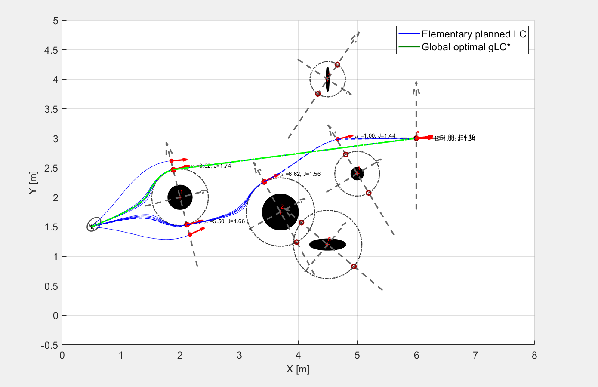

## Optimisation des coûts de calcul pour la planification à long terme

À des fins de plannification et d’optimisation de trajet pour un robot mobile, le programme fourni pour l’exercice utilise des cycles limites et un algorithme de calcul de graphes sous matlab afin de fournir un arbre des trajectoires possibles. Les noyaux de l’arbre sont des changements de trajectoire, des choix que le robot mobile devra entreprendre pour atteindre sa cible. Les feuilles de l’arbre sont les dernières opérations réalisées par le robot pour atteindre sa cible. Un algorithme doit parcourir l’arbre afin de déterminer quel est le parcours le moins coûteux à prendre pour le robot. Cependant, plus le trajet est long et plus l’arbre de parcours sera exponentiellement grand. La consommation en ressources et en temps des algorithmes s’en retrouve très fortement impactée, dans un but d’optimisation de ces temps de calcul, des opérations stochastiques doivent être exploitées afin de réduire la taille de l’arbre. Nous parlerons ici d’élaguage.

**Application d'opérations stochastiques**

Les opérations stochastiques peuvent prendre divers formes. Ainsi, il est possible d’élaguer des branches de l’arbre en coupant les noeux sur lesquels ils sont attachés. Cela peut se faire de manière aléatoire, où un pourcentage des noeuds de l’arbre seront effacés ou déterministe en prenant une partie de l’arbre uniquement.

Dans un premier temps, nous avons mis en place une première solution d’élaguage aléatoire de l’arbre avec un coefficient de suppriession. Concrétement, un algorithme va supprimer 10% des noyaux de l’arbre excepté la racine. On notera que lors de ses itérations, l’algorithme peut supprimer un noyau puis supprimer le noyau au dessus. L’élaguage est purement aléatoire et ne prend pas en compte la nécesssité du parcours à atteindre une feuille. Des chemins ne pouvant amener le robot à sa cible peuvent se produire et ces-derniers doivent être pris en compte lors de la plannification.

Pour éviter que l'optimisation stochastique ne "triche" en générant des chemins incomplets et donc peu couteux, nous avons ajouté une vérification pour s'assurer que les chemins atteignent bien la cible. Pour cela, l’algorithme de recherche du meilleur chemin fournit dans l’exercice $TreeProcess()$  calcule le chemin le moins couteux et si le dernier sommet du chemin n’indique pas les coordonnées de la cible, une nouvelle itération d’optimisation stochastique est réalisée. Ce méchanisme garantit que seuls les chemins complets sont pris en compte lors de la sélection du meilleur trajet.

Toutefois, l’obligation de réiterer l’optimisation stochastique étouffe les bénéfices qu’elle génère. Son application sur des arbres petits n’apporte pas de réelles améliorations, ces-dernières étant plus importantes sur un parcours plus long et un environnement plus complexe.

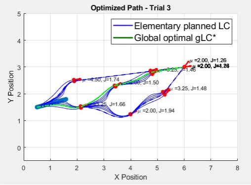

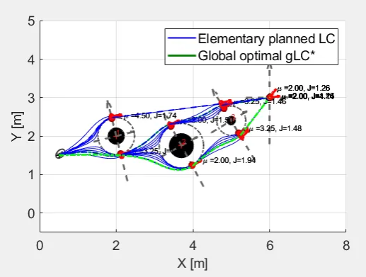