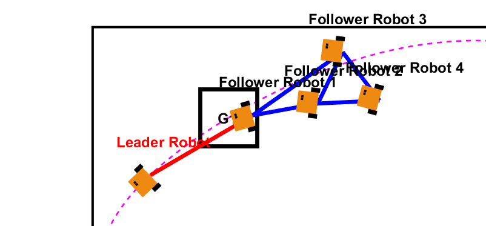

# Introduction {.unlisted .unnumbered}

# Getting Started

## Summary of the main steps of `leader_follower_save_data.m`


# Main investigations

## Planning, control and decision-making

### Proposition of a leader behaviour for smooth target transition

To address the issue of erratic navigation behavior, which imposes significant strain on real-world vehicle components, we propose two approaches aimed at achieving smoother transitions between waypoints.

**Exploring Potential Solutions**
During the exploration phase, three potential strategies emerged:

Implementing a Bézier Curve Path
The idea here was to design a circular or Bézier curve path for the robot to follow, replacing the abrupt waypoint switching in the navigation algorithm with a command law to track the curve.

Optimizing Orientation at Waypoints
Another approach involved modifying the command law to direct the robot toward the next waypoint (n+1) while already aligning its orientation for the subsequent waypoint (n+2).

Minimizing Steering Effort
Reducing the robot's steering angle changes could result in smoother movements. However, this might compromise maneuvering precision in certain situations, creating a trade-off between smoothness and accuracy.

#### Implementing a path-based approach

A bézier curve is a parametric curve which is a set of discrete control points based of the list
of given waypoints. The idea is to create a smooth path that approaches all waypoints.


While searching on the web, we've found this sample of script that returns a bezier curve from a list of points :

```bash
function B = computeBezier(P, t)
    n = size(P, 2) - 1;
    B = zeros(2, length(t));
    for k = 1:length(t)
        B(:, k) = [0; 0];
        for i = 0:n
            B(:, k) = B(:, k) + nchoosek(n, i) * (1 - t(k)).^(n - i) * t(k).^i * P(:, i + 1);
        end
    end
end
```
By testing the Bézier curve method, we observed that the generated path was smooth but did not pass through all the designated waypoints, as shown in the following illustration:


To overcome this limitation, we shifted to a spline-based approach. Splines are mathematical functions that generate smooth paths using low-degree polynomials, ensuring that the curve passes through all waypoints.

Here's the matlab code that generate the spline :

```bash
t_points = 1:size(waypoints, 2);
t_spline = linspace(1, size(waypoints, 2), 1000);
spline_curve = spline(t_points, waypoints, t_spline);
```
The spline-based solution corrected the earlier issue, providing a path that is both smooth and passes through all waypoints:


However, the robot would stop at the last waypoint. To create a closed-loop path, the first waypoint is appended to the end of the waypoint list:

```bash
waypoints = [waypoints, waypoints(:, 1)];
```
Which finally give theses results in the following final trajectory:


**Synthetizing a command law to follow the path**

Once the spline path is defined, a command law is implemented to enable the leader robot to follow the discretized curve points. Here’s the code that enables it:

```bash
%% Make the leader travel between waypoints
    
    current_position = x(1:2, 1); % of the leader
    
    % update target ID during simulation
    if norm(current_position - spline_curve(:, index_target)) < close_enough % target offset
        if index_target < length(t_spline)
            index_target = index_target + 1; % go to next waypoint
        else
            index_target = 1; % keep moving toward the current waypoint
        end
    end
    
    % move towards the target
    dxi(:, 1) = leader_controller(current_position, target_position);

    % set the next discretized point on the curve as target
    target_position = spline_curve(:, index_target);
```

This code ensures the robot follows a smooth trajectory, as shown in the simulation screenshot below:


**Reaching the nearest point on the curve in a smooth way**

To improve convergence, the robot can first move to the nearest point on the curve before proceeding to the next target. This ensures a smoother transition and minimizes deviation from the desired path.

The solution was to compute the nearest point using :

```bash
distances = sqrt(sum((spline_curve - current_position).^2, 1));
[~, index_target] = min(distances);
```

Once the nearest point is identified, the robot is commanded to navigate to that position. After reaching the point, it resumes its normal behavior of following the curve’s discretized points to achieve all target waypoints.

This adjustment produces a smoother convergence, as illustrated here:


However, directly moving toward the nearest point in a straight line can disrupt the formation and induce strain on the leader’s trajectory. To resolve this, we propose a smoother approach that involves aligning the robot with the path's tangent before merging.

Smooth Merge Using Tangent Alignment
Instead of directly targeting the nearest point, the leader robot computes the local tangent of the spline at the nearest point and selects a target further along the tangent. This ensures a gradual and smooth alignment with the curve.

The tangent and the adjusted target point are computed as follows:

```bash
%compute tangent
dx_dt = diff(spline_curve(1, :)) ./ diff(t_spline);
dy_dt = diff(spline_curve(2, :)) ./ diff(t_spline);


if index_target < length(t_spline)
    dx = dx_dt(index_target);
    dy = dy_dt(index_target);
else
    dx = dx_dt(index_target - 1);
    dy = dy_dt(index_target - 1);
end

tangent = [dx; dy];
tangent_norm = norm(tangent);
if tangent_norm > 0
    tangent = tangent / tangent_norm;
else
    tangent = [1; 0]; % fallback
end

% adjusting the targer using tangent direction
look_ahead_distance = 1;
smooth_target = target_position + look_ahead_distance * tangent;
```

This method allows the leader to smoothly merge onto the path by following the tangent direction, resulting in a more seamless transition to the spline trajectory:


#### Using a command law to point to the next waypoint 

@Alexis it's your show there

## Adding a Fourth Follower to the Diamond Formation

To expand the symmetric diamond formation, we introduced a fourth follower positioned behind Robots 2 and 3. This required updating the underlying topology of the multi-robot system (MRS) to maintain geometric constraints and ensure a rigid structure.

```bash
N = 5
```

**Updating the Laplacian Matrix**
The diamond formation is modeled using a Laplacian matrix to define the interaction topology among the robots. With the addition of the fourth follower, the adjacency matrix A and degree matrix 𝐷 were updated as follows:


which gives us in matlab :

```bash
A = [0 1 0 0 0;
     1 0 1 1 0;
     0 1 0 1 1;
     0 1 1 0 1;
     0 0 1 1 2];

D = [0 0 0 0 0;
     0 3 0 0 0
     0 0 3 0 0;
     0 0 0 3 0;
     0 0 0 0 2];

L = D - A;
```

**Benefits of the Updated Topology**

<ins>Rigid Connectivity</ins>: The updated Laplacian matrix ensures the connectivity and geometric constraints of the diamond formation. It maintains symmetry and allows for cohesive movement of the formation.

<ins>Flexibility for Further Changes</ins>: The adjacency matrix structure provides a clear framework for adding more followers or modifying formations in future stages of the project.*

**Simulation Results**
The updated topology was tested in simulations, demonstrating that the geometric constraints were effectively maintained, and the added follower smoothly integrated into the diamond formation. This rigid structure will serve as the foundation for the remaining phases of the project.


## Measuring the level of precision to maintain the desired geometric formation

To measure the level of precision of the diamond formation, we suggest to compute the distance between two robots at each iteration of the simulation to verify that they maintain a similar distance through time.

**Approach**

<ins>Defining Pairs of Robots</ins>:
Based on the adjacency matrix 𝐴, we defined pairs of robots that should maintain fixed distances during the formation.

<ins>Distance Error Metric</ins>:
At each iteration, the distance between two robots in a pair is calculated, and the deviation from the desired distance is squared and summed for all pairs. The error metric is expressed as:


```katex
E_{distance} = \sum_{
\begin{subarray}{l}
   i,j\ \in \text{ Pairs}
\end{subarray}}(d_{ij} - d_{ij}^{ref})^2
```
with dij being the current distance between robots i and j and dij ref being the disred distance between both robots.

**Implementing in matlab**
```bash
E_distance = 0;
    for k = 1:length(distance_pairs_i)
        i = distance_pairs_i(k);
        j = distance_pairs_j(k);
        d_ij = norm(x(1:2, i) - x(1:2, j));
        E_distance = E_distance + (d_ij - desired_distance)^2;
    end
    E_distance_array(t) = E_distance;
```

**visualizing the results :**

```bash
figure;
subplot(2,1,1);
plot(1:iterations, E_distance_array, 'LineWidth', 2);
xlabel('Iteration');
ylabel('Distance Error');
title('Distance Error over Time');
```

**Results and Observations**
The plotted results indicate the distance error over time:


At the beginning of the simulation, the distance errors are high due to the robots adjusting their initial positions.
Once the formation stabilizes, the error decreases significantly and remains close to zero, confirming that the geometric formation is maintained effectively throughout the simulation.

# Obstacles avoidance

1. Addition of obstacles

We treat obstacles as simple circles in the plane. Each obstacle has an 
(x,y) center and a fixed radius. We place these circles in the environment 
by defining a matrix of obstacle positions, then drawing them. For example:

```bash
% List of obstacles as (x, y) centers
obstacles = [
    0.5, 0.5;
   -0.5, -0.2;
    0.0, -0.7
];

obstacle_radius = 0.15;  % radius of each obstacle

% Plot them (one circle for each row in 'obstacles')
hold on;
for i = 1:size(obstacles, 1)
    theta = linspace(0, 2*pi, 50);
    x_circle = obstacle_radius * cos(theta) + obstacles(i, 1);
    y_circle = obstacle_radius * sin(theta) + obstacles(i, 2);
    fill(x_circle, y_circle, 'r', ...
         'FaceAlpha', 0.3, 'EdgeColor', 'r');
end
hold off;
```

We store obstacles in a matrix, with each row representing an obstacle' center.

2. Obstacle avoidance

After computing the formation control for the robots, we run an algorithm to detect any obstacle that lies on the path of one of the robots.

For this, we compute the distance between each robot and each obstacle:

```bash
dist_to_obstacle = norm(x(1:2, i) - obstacle_position);
```

- If, due to a bug or any unexpected situation, the robot ends up inside the obstacle’s circle (dist_to_obstacle < obstacle_radius), we push it strongly away using a repulsive force.
- If the robot’s distance to the obstacle is below some minimum distance (but still outside the obstacle), it will “steer around” it. This is done by computing a tangential direction and updating the robot’s velocity command accordingly.

To manage the new command law, the robot's velocity is updated to combine:
The tangential direction (to move around the obstacle) multiplied with a gain,
and a small repulsive component to push the robot further from the obstacle.

```bash
dxi(:, i) = dxi(:, i) + tangent_gain * tangent_dir + radial_gain  * direction_out;
```


*Picture of the robot leader avoiding an obstacle by orbiting arround it.*


3. Formation switching

When traveling, the robot might encounter obstacles while in a diamond formation, which can lead to sharper or “tighter” maneuvers. 
Hence, we implemented a “formation switch” so the robots can follow a line formation when an obstacle is too close. This tends to be smoother in narrow spaces.

Once the obstacle is avoided, the robots revert to (recover) the diamond formation.

To enable this switch, we introduce a new Laplacian matrix:


```bash
L_line = [1 -1 0 0 0;
          -1 2 -1 0 0;
          0 -1 2 -1 0;
          0 0 -1 2 -1;
          0 0 0 -1 1];
```
We also define hysteresis thresholds for the minimal distance between any robot and an obstacle. 
If that distance becomes too small, we switch to the line formation; once it’s safe again, we switch back to diamond.

The final avoiding formation is a chain line from the leader all the way to the last following robot.


*Picture of the straight line reverting to the diamond formation after encountering an obstacle*