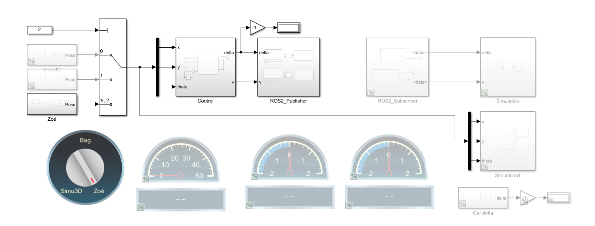
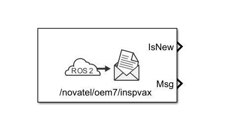
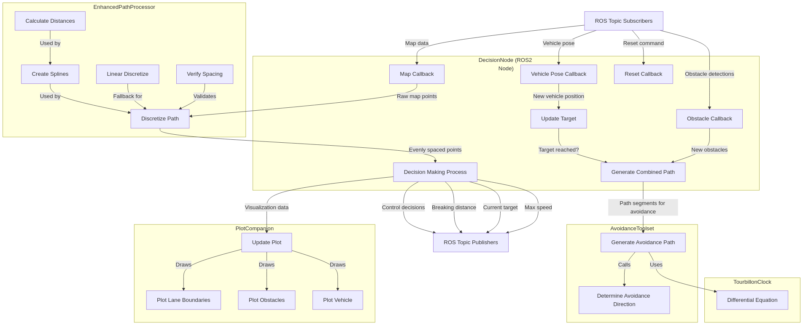
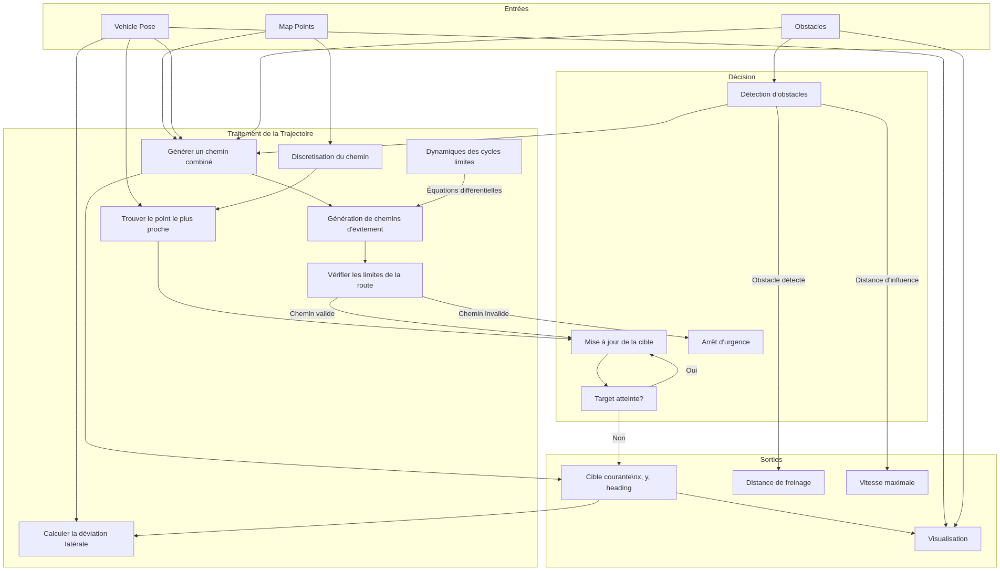
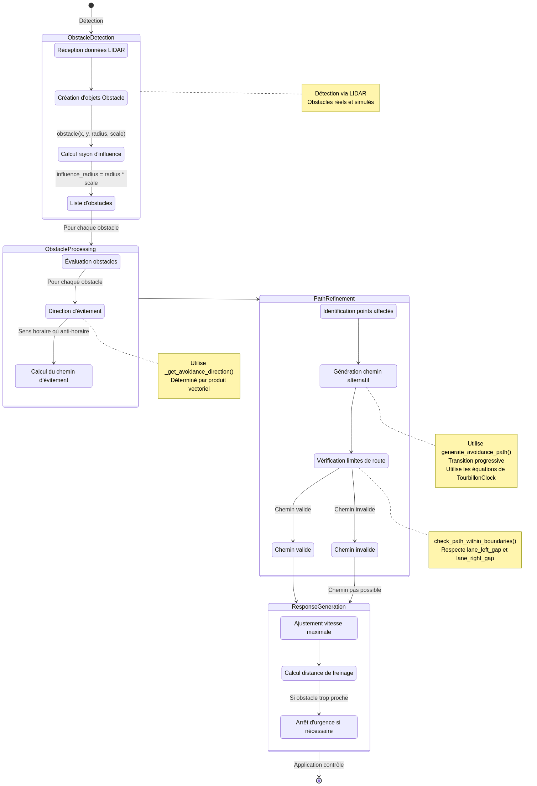
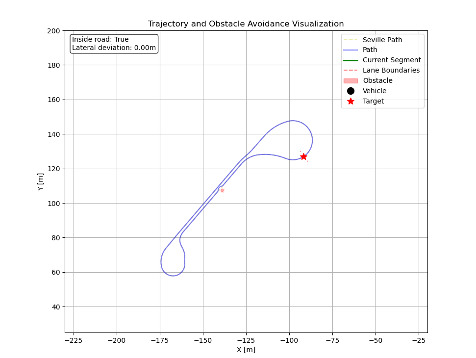

# Introduction {.unnumbered .unlisted}

Le Challenge UTAC est une compétition internationale qui rassemble universités, écoles d'ingénieurs et Instituts Universitaires de Technologie (IUT) autour des défis de la mobilité future. Organisée par des acteurs de l'industrie automobile, dont la Société des Ingénieurs de l'Automobile (SIA), cette compétition encourage les étudiants à innover dans des domaines tels que la conduite autonome, la connectivité et la cybersécurité. Les démonstrations et présentations se déroulent sur le circuit de Linas-Montlhéry, offrant une plateforme pour les innovations étudiantes.

Le projet UTonome, porté par l'association éponyme de l'Université de Technologie de Compiègne (UTC), vise à représenter l'UTC lors de ce challenge. L'association, structurée en quatre pôles spécialisés — Simulation, Planification, Ordonnancement et Perception — regroupe des étudiants intéressés par les technologies de mobilité. En tant qu'étudiant, j'ai contribué au développement d'un module de planification et de décision pour un véhicule autonome.

Ce module, intégré dans un système basé sur le framework ROS (Robot Operating System), permet au véhicule de naviguer de manière autonome et sécurisée dans des environnements dynamiques. Il inclut des fonctionnalités telles que la gestion des obstacles, la planification de trajectoires optimales, et la visualisation en temps réel des données de navigation.

Ce rapport présente les étapes de développement du module de planification et de décision, ainsi que les résultats obtenus lors des tests sur simulateur. Il détaille les choix techniques, les algorithmes implémentés, et les perspectives d'amélioration pour les prochaines itérations du projet.

\newpage

# Etat de l'Art

## Travaux Précédents

Le projet UTonome 2024 (P24) a été réalisé en utilisant MATLAB comme environnement de développement principal. Ce choix a permis d'exploiter les capacités de simulation et de traitement de données offertes par ce logiciel.

### Simulation de véhicules avec le simulateur CARLA

Pour tester et valider les algorithmes développés, le simulateur CARLA a été utilisé. CARLA est un simulateur de conduite autonome open-source qui permet de créer des scénarios réalistes et de tester les performances des véhicules autonomes dans des environnements virtuels.

### Module de planification

Le module de planification est basé sur l'algorithme A*. Cet algorithme est utilisé pour rechercher le plus court chemin entre un point de départ et une destination, en tenant compte des contraintes de l'environnement. L'algorithme A* a été choisi pour son efficacité et sa capacité à trouver des chemins optimaux dans des environnements complexes.

### Module de décision/contrôle

Le module de décision/contrôle repose sur le concept de "contrôle par waypoints". Ce concept permet de définir des points de passage que le véhicule doit suivre pour atteindre sa destination. Trois modes de conduite ont été implémentés :

1. **Suivi de cible (loi d'attraction)** : Ce mode permet au véhicule de suivre une cible mobile en utilisant une loi d'attraction. La cible peut être un autre véhicule ou un point de passage défini par le module de planification.

2. **Adaptive Cruise Control (ACC)** : Ce mode permet au véhicule de maintenir une distance de sécurité avec le véhicule qui le précède. L'ACC ajuste automatiquement la vitesse du véhicule en fonction de la distance et de la vitesse relative du véhicule précédent.

3. **Évitement d'obstacles** : Ce mode permet au véhicule de détecter et d'éviter les obstacles sur sa trajectoire. Les obstacles peuvent être des véhicules, des piétons ou des objets statiques.

### Module de perception

Le module de perception est responsable de la détection des panneaux de signalisation en temps réel. Un algorithme léger a été développé pour permettre une détection rapide et précise des panneaux. Ce module est essentiel pour assurer la sécurité et le respect des règles de circulation par le véhicule autonome.

## Intégration sur un véhicule réel

### Conversion en Simulink

Dans le cadre de l'intégration du module de planification/décision sur la Renault Zoé, le projet a été entièrement converti en Simulink pour tirer parti des capacités de simulation et de modélisation. Cette conversion visait à faciliter le développement et le test des algorithmes de planification et de décision dans un environnement contrôlé avant leur déploiement sur le véhicule. L'objectif final étant de créer un module que l'on peut compiler et exécuter directement sur le véhicule réel (Matlab et Simulink Coder).

Des blocs Simulink spécifiques ont été utilisés pour gérer les interactions avec le Robot Operating System (ROS), permettant ainsi de publier et de souscrire à des topics ROS. Cette intégration était essentielle pour assurer une communication fluide entre le module de planification/décision et le système de contrôle du véhicule.

{height=15%}

Le modèle Simulink a été créé en utilisant la classe __AutonomousVehicle__, partie de la dernière édition du projet UTonome. Cette classe a été modifiée pour être conforme aux spécifications concernant l'exécution en temps réel, et la génération et compilation de code C++ pour le déploiement sur le véhicule.

Autour, le modèle Simulink a été conçu pour être modulaire, pouvant être configuré en mode "Simulation" ou "Contrôle de véhicule réel". Cette modularité permet de tester les algorithmes de planification et de décision dans un environnement simulé, puis de les déployer sur le véhicule réel pour des essais sur route. __Cette transformation a été réalisée en collaboration avec Cyril PETER, président de l'association UTonome.__

### Challenge rencontré

Cependant, des problèmes de connexion sont survenus lors des essais d'intégration entre le projet UTonome et le véhicule. Pour identifier la source du problème, plusieurs configurations ont été testées. Une première configuration consistait à installer MATLAB sur un ordinateur à part, connecté au véhicule. Cette approche visait à isoler les environnements de développement et d'exécution, mais des problèmes de latence et de synchronisation ont été observés, rendant la communication inefficace. Parfois, la connexion entre les deux systèmes était complétement inopérante (Erreur `Transport Stopped`).

Une seconde configuration, avec MATLAB installé directement sur l'ordinateur de bord du véhicule, a permis de réduire les problèmes de latence. Cependant, cette configuration a révélé une incompatibilité entre les versions de ROS utilisées par MATLAB (Humble) et celles installées sur le véhicule (Jazzy). Cette incompatibilité a empêché une communication fluide entre les deux systèmes, rendant nécessaire une solution alternative.

Pour surmonter ces incompatibilités, il a été décidé de développer la partie génération de waypoints et contrôle en Python. Cette approche permet de bénéficier de la flexibilité et de la compatibilité accrue de Python avec les différentes versions de ROS. Les avantages de Matlab ne sont pas perdus pour autant, puisqu'il est possible d'exécuter du code Python depuis Matlab, et de passer des données entre les deux environnements.

Cette solution a permis de résoudre les problèmes de compatibilité tout en assurant une intégration efficace du module de planification/décision sur la Renault Zoé. Les essais ultérieurs ont montré une amélioration significative de la communication entre le module et le système de contrôle du véhicule, permettant ainsi de valider l'approche adoptée.

# Adaptation du module de planification

## Architecture du module

Le module de planification/décision est conçu pour permettre une navigation sûre et efficace dans des environnements dynamiques. L'architecture est composée de plusieurs sous-systèmes interconnectés, chacun ayant un rôle spécifique dans la réalisation de cet objectif.

__Planification de Trajectoire :__

La planification de trajectoire est initialement réalisée par un nœud externe qui fournit les waypoints de la carte. Ces waypoints définissent le chemin global que le véhicule doit suivre pour atteindre sa destination. Le rôle du module est de transformer ces waypoints en une trajectoire exécutable par le véhicule.

__Évitement d'Obstacles :__

L'évitement d'obstacles est réalisé par les outils fournis dans `AvoidanceToolset`. Ces outils détectent et contournent les obstacles en utilisant des ensembles de coordonnées pour représenter les positions des obstacles et du véhicule. Les algorithmes d'évitement d'obstacles calculent des trajectoires alternatives en temps réel, permettant au véhicule de naviguer en toute sécurité dans des environnements encombrés. La détection d'obstacles est réalisée en intégrant des données de capteurs, telles que les lidars ou les caméras, pour identifier les obstacles potentiels sur le chemin du véhicule.

__Traitement de Chemin :__

Le traitement des points de chemin est effectué par `EnhancedPathProcessor`, qui utilise des splines cubiques pour interpoler les waypoints fournis par le nœud externe. Cette interpolation permet de générer des trajectoires lisses et continues, améliorant ainsi la stabilité et le confort de conduite. Le processeur de chemin peut également ajuster dynamiquement les trajectoires en fonction des conditions environnementales ou des obstacles détectés, en effectuant une rediscrétisation des waypoints pour une navigation plus fluide.

__Intégration et Communication :__

Le nœud ROS agit comme le centre de communication du système. Il reçoit les waypoints de la carte, les positions des obstacles, et transmet les commandes de contrôle au véhicule. L'utilisation de ROS permet une intégration facile avec d'autres modules et capteurs, facilitant l'extensibilité du système. Le nœud ROS gère également la synchronisation des données entre les différents composants, assurant une coordination fluide et en temps réel.

__Visualisation et Débogage :__

Les outils de visualisation fournissent des moyens de tracer les trajectoires et les obstacles, facilitant ainsi le débogage et l'analyse des performances du système. Les tracés permettent aux développeurs de visualiser les décisions prises par le système de planification et d'évitement d'obstacles, ce qui est crucial pour l'amélioration continue et la validation des algorithmes.

__Intégration Globale :__

L'architecture globale du module est conçue pour être modulaire et extensible. Chaque composant joue un rôle spécifique dans la planification et l'exécution des trajectoires, tout en étant capable de fonctionner de manière autonome. Cette modularité permet d'ajouter ou de modifier des fonctionnalités sans affecter l'ensemble du système.

Les données des capteurs sont traitées par `AvoidanceToolset` pour détecter les obstacles. Le nœud ROS utilise ces informations pour générer des trajectoires sûres à partir des waypoints fournis. `EnhancedPathProcessor` affine ces trajectoires pour assurer une navigation fluide. Le nœud ROS coordonne ces interactions et transmet les commandes finales au véhicule.

Cette architecture robuste et flexible permet au véhicule autonome de naviguer efficacement dans divers environnements, tout en assurant la sécurité et le confort des passagers.

## Planification de trajectoires

La planification de trajectoires est une composante essentielle du module de planification et de décision pour le véhicule autonome. Cette section détaille les méthodes et algorithmes utilisés pour générer des trajectoires sûres et optimales, permettant au véhicule de naviguer efficacement dans des environnements dynamiques.

### Génération de Waypoints

La génération de waypoints est la première étape de la planification de trajectoires. Les waypoints sont des points de passage que le véhicule doit suivre pour atteindre sa destination. Ces points sont déterminés par un nœud externe qui fournit une carte globale du trajet. L'algorithme de planification utilise ces waypoints pour créer une trajectoire initiale.

### Interpolation par Splines Cubiques

Pour assurer une navigation fluide et stable, les waypoints sont interpolés à l'aide de splines cubiques. L'outil EnhancedPathProcessor est utilisé pour cette tâche. Les splines cubiques permettent de générer des trajectoires lisses et continues, évitant ainsi les mouvements brusques et améliorant le confort de conduite. L'interpolation prend en compte les contraintes dynamiques de l'environnement, telles que la présence d'obstacles ou les conditions de la route.

Les splines cubiques sont générées en utilisant des polynômes de degré trois pour interpoler les waypoints fournis. Chaque segment de la spline entre deux waypoints \( (x_i, y_i) \) et \( (x_{i+1}, y_{i+1}) \) est défini par une équation cubique de la forme :

$$  S_i(x) = a_i + b_i(x - x_i) + c_i(x - x_i)^2 + d_i(x - x_i)^3 $$

Les coefficients $a_i, b_i, c_i$ et $d_i$ sont déterminés de manière à assurer la continuité et la différentiabilité de la spline aux points de jonction. Les conditions de continuité imposent que la spline et ses premières et secondes dérivées soient continues aux waypoints. Cela se traduit par les équations suivantes :

$$  S_i(x_i) = y_i $$
$$  S_i(x_{i+1}) = y_{i+1} $$
$$  S_i'(x_{i+1}) = S_{i+1}'(x_{i+1}) $$
$$  S_i''(x_{i+1}) = S_{i+1}''(x_{i+1}) $$

Ces conditions garantissent que la trajectoire générée est lisse et continue, permettant une navigation fluide du véhicule autonome.

### Ajustement Dynamique des Trajectoires

Les trajectoires générées sont continuellement ajustées en fonction des conditions environnementales et des obstacles détectés. L'outil AvoidanceToolset intègre les données d'obstacles retournés par les modules de perception pour calculer des trajectoires alternatives en temps réel, en utilisant la méthode des cycles limites. Cette approche permet au véhicule de naviguer en toute sécurité dans des environnements encombrés.

Si la trajectoire candidate avec évitement sort de la voie, elle est considérée comme invalide. Dans ce cas, le système passe en état "Arrêt d'urgence" et arrête le véhicule en publiant une distance de freinage à 0 (que le contrôleur de vitesse interprète comme un freinage d'urgence).

### Fourniture de la cible au contrôleur

Une fois la trajectoire générée, une étape de map matching est réalisée pour déterminer le waypoint le plus proche du véhicule. Ensuite, la cible, définie comme le point suivant de la trajectoire, est fournie au contrôleur pour le suivi de cible. Le map matching est effectué en utilisant une méthode de recherche de plus proche voisin, en utilisant les coordonnées GNSS-RTK du véhicule et des waypoints.

## Gestion des obstacles

{height=50%}

La gestion des obstacles est un processus essentiel pour garantir la sécurité et l'efficacité du déplacement autonome. Ce processus peut être décomposé en plusieurs étapes clés, chacune jouant un rôle crucial dans la détection et l'évitement des obstacles.

### Détection des Obstacles

La détection des obstacles commence par la réception des données du module de perception. Ces données permettent d'identifier les objets présents dans l'environnement. À partir de ces informations, des objets "Obstacle" sont créés, chacun étant caractérisé par ses coordonnées (x, y), un rayon, et une échelle. Le rayon d'influence de chaque obstacle est ensuite calculé en multipliant le rayon par l'échelle, déterminant ainsi la zone affectée par l'obstacle.

### Traitement des Obstacles

Une fois les obstacles détectés, chaque obstacle est évalué pour déterminer son impact potentiel sur le chemin actuel. La direction d'évitement est calculée en utilisant une fonction spécifique, _get_avoidance_direction(), qui détermine si l'évitement doit se faire dans le sens horaire ou anti-horaire. Cette décision est basée sur le produit vectoriel. Ensuite, un chemin d'évitement est calculé pour contourner l'obstacle de manière progressive, en utilisant les équations de TourbillonClock.

### Affinement du Chemin

L'affinement du chemin implique l'identification des points du chemin actuel qui sont affectés par les obstacles. Un nouveau chemin alternatif est généré pour éviter ces obstacles tout en assurant une transition en douceur. Ce chemin est ensuite vérifié pour s'assurer qu'il respecte les limites de la route, en utilisant des fonctions comme check_path_within_boundaries() et en respectant les marges de sécurité (lane_left_gap et lane_right_gap).

Le nouveau chemin est calculé en utilisant l'unique ensemble de points affecté par l'obstacle, le plus proche de l'obstacle. Cela permet d'éviter de créer un chemin invalide (qui croiserait la trajectoire de retour du véhicule) considérant que la probabilité que l'obstacle soit toujours présent au retour est faible (le piéton a traversé par exemple).

### Périodes de transition

Afin d'éviter des changements brusques de trajectoire, des périodes de transition sont introduites pour permettre au véhicule de s'adapter progressivement à l'évitement. Concrètement, avant l'évitement, une transition en sigmoid est effectuée pour que le véhicule commence à s'écarter de la trajectoire initiale. Cette transition est contrôlée par un paramètre de dilatation du sigmoid, qui détermine la vitesse à laquelle le véhicule s'écarte de la trajectoire.

