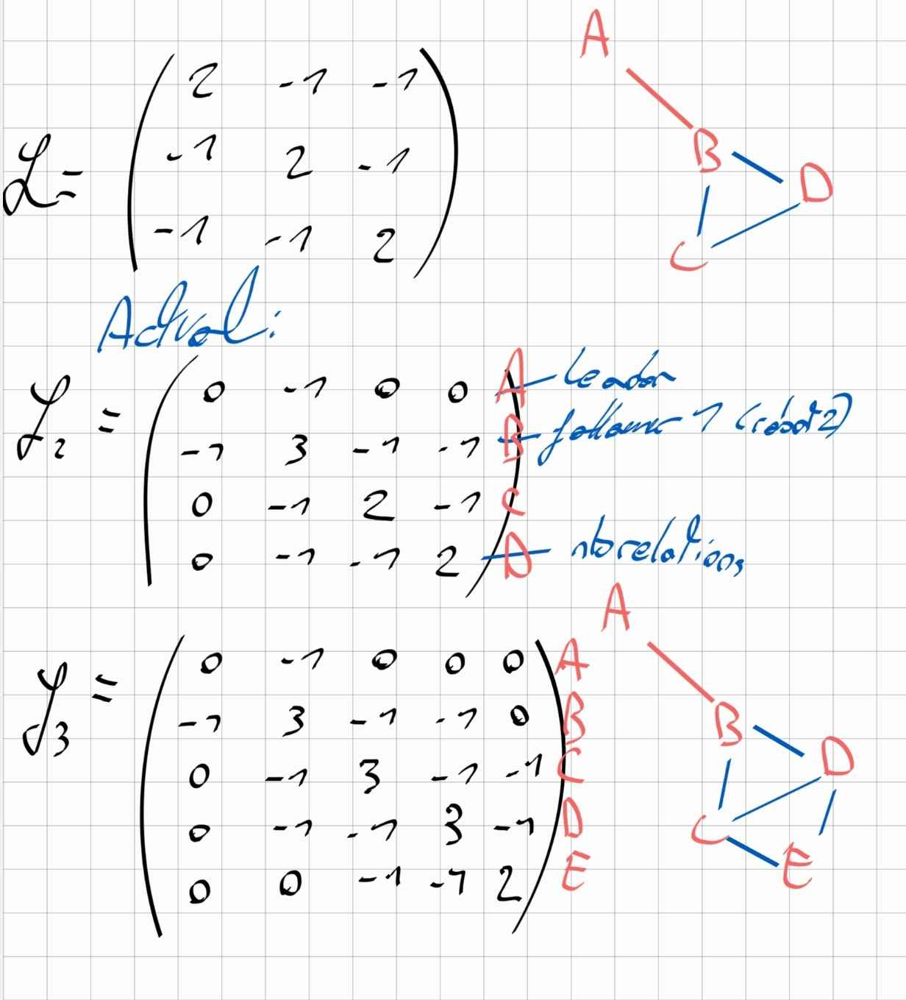

# Introduction {.unlisted .unnumbered}

# Getting Started

## Summary of the main steps of `leader_follower_save_data.m`


# Main investigations

## Planning, control and decision-making

### Proposition of a leader behaviour for smooth target transition

To correct that erratic behaviour, that creates a lot of strains on a real life vehicle components, we propose to implement different solutions.

Different ideas came to our minds while searching for a solution to a smoother way of navigation.

The first was to draw a circular path like a bézier curve for the robot to follow.
It involved replacing the current switch in the robot navigation algorithm to a command law which will follow the curve.

The second was to give a command law to the robot that dictates the position to the next waypoint (n+1) with
an angle that points to the third waypoint (n+2).

The third was to minimize the (j'ai plus le mot) so that the robot would steer less.
This however would give disadvantages to the robot in manuver precision but would also be smooth.


#### Using a discretized bezier curve

A bézier curve is a parametric curve which is a set of discrete control points based of the list
of given waypoints. The idea is to create a smooth path that approaches all waypoints.


Searching on the web, we've found this sample of script that returns a bezier curve from a list of points :

```bash
function B = computeBezier(P, t)
    n = size(P, 2) - 1;
    B = zeros(2, length(t));
    for k = 1:length(t)
        B(:, k) = [0; 0];
        for i = 0:n
            B(:, k) = B(:, k) + nchoosek(n, i) * (1 - t(k)).^(n - i) * t(k).^i * P(:, i + 1);
        end
    end
end
```
While trying this approach, we've seen that although the given curve is smooth, it does not pass through all prime waypoints.


Instead, we've decided to go for a spline :

```bash
t_points = 1:size(waypoints, 2);
t_spline = linspace(1, size(waypoints, 2), 1000);
spline_curve = spline(t_points, waypoints, t_spline);
```

A spline is a mathematics function that yields similar results using low degree polynomials. Thus correcting the precedent issue.


Now that the path is smooth and pass at each prime waypoints. We can set the loop by adding the first waypoint at the end of the list.

```bash
waypoints = [waypoints, waypoints(:, 1)];
```


**Synthetizing a command law to follow the path**

here's the code provided for the robot to follow
the curve discretized points :
```bash
%% Make the leader travel between waypoints
    
    current_position = x(1:2, 1);
    
    % update target ID    
    if norm(current_position - spline_curve(:, index_target)) < close_enough % target offset
        if index_target < length(t_spline)
            index_target = index_target + 1; % go to next waypoint
        else
            index_target = 1; % keep moving toward the current waypoint
        end
    end
    
    % set the next discretized point on the curve as target
    target_position = spline_curve(:, index_target);
    
    % move towards the target
    dxi(:, 1) = leader_controller(current_position, target_position);
```

which gives us this simulation where the unicycle follows a smooth path and goes through each waypoints :


#### Using a command law to point to the next waypoint 


## adding a fourth follower

```bash
N = 5
```

In order to improve the diamond formation, the program uses
a Laplacian matrix. Since we've added a new follower, we had to
update the matrix :



which gives us in matlab :

```bash
A = [0 1 0 0 0;
     1 0 1 1 0;
     0 1 0 1 1;
     0 1 1 0 1;
     0 0 1 1 2];

D = [0 0 0 0 0;
     0 3 0 0 0
     0 0 3 0 0;
     0 0 0 3 0;
     0 0 0 0 2];

L = D - A;
```


## reaching the nearest point on the curve

To reach the nearest point on the curve before the target, thus, making a better convergence.

The solution was to compute the nearest point using :

```bash
distances = sqrt(sum((spline_curve - current_position).^2, 1));
```

and then fetch the lowest distance :

```bash
[~, index_target] = min(distances);
```

and then ordering the robot to go to that point, when it reaches this point, it pursuit it's normal behaviour which is to follow each target point on the curve to reach all 4 targets waypoints.

which gives us :


## Measuring the level of precision to maintain the desired geometric formation

To measure the level of precision of the diamond formation, we suggest to compute the distance between two robots at each iteration of the simulation to verify that they maintain a similar distance through time.

Thus, we started by defining pairs of robots based from matrix A. Then, we instanciate an array of zero values.

within the main loop, we compute the distance from two robots in a pair at each iteration using this loop :

L'erreur de la distance est calculée à partir de la somme de tous les delta entre les positions du robot A et du robot B de chaque pair au carré.

la formule est de cette forme :
```latek
E_{distance} = \sum_{i,j \in Pairs} (d_{ij} - d_{ij}^{ref})^2
```

```bash
E_distance = 0;
    for k = 1:length(distance_pairs_i)
        i = distance_pairs_i(k);
        j = distance_pairs_j(k);
        d_ij = norm(x(1:2, i) - x(1:2, j));
        E_distance = E_distance + (d_ij - desired_distance)^2;
    end
    E_distance_array(t) = E_distance;
```

et pour afficher le plot de ce tableau :

```bash
figure;
subplot(2,1,1);
plot(1:iterations, E_distance_array, 'LineWidth', 2);
xlabel('Iteration');
ylabel('Distance Error');
title('Distance Error over Time');
```

Ce qui nous donne ces résultats :


Nous pouvons ainsi observer le début de la simulation où les erreurs de distance sont très élevées. Il s'agit du moment où les robots reprennent position.
Une fois la formation réalisée, l'erreur de distance devient quasiment nulle et se maintient plus ou moins au fil des itérations de la simulation.

