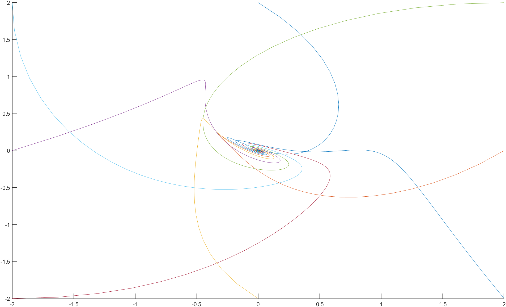
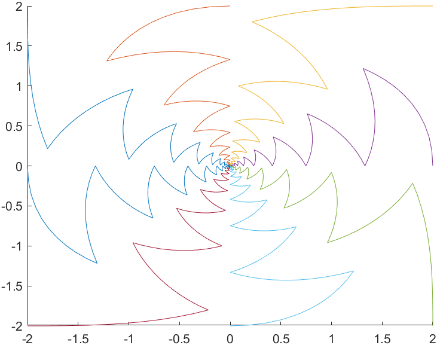
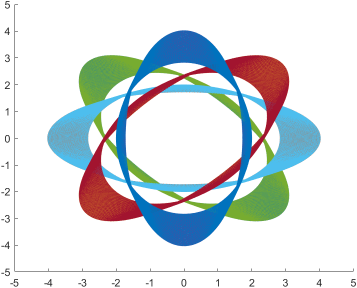
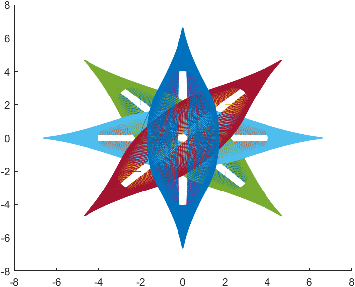
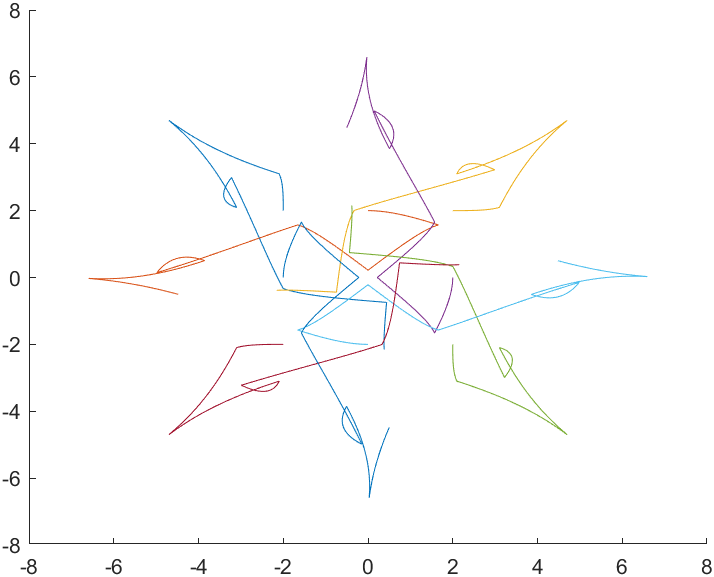
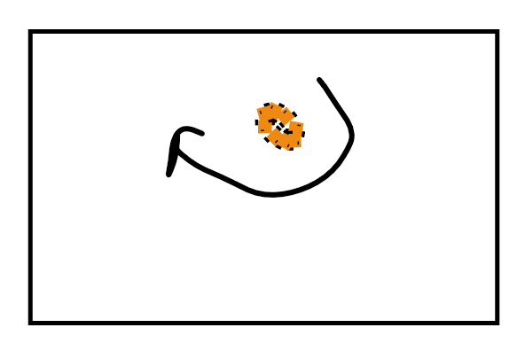
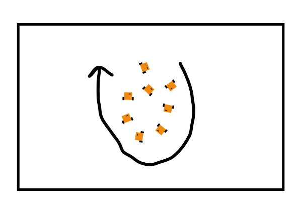

# Consensus-based control for mixing arts and sciences

## Pseudo code

1. Import the necessary libraries and initialize the required variables:
  - Define the number of robots.
  - Create an instance of Robotarium.
  - Define the Laplacian matrix.
2. Main loop:
  - For each iteration (1000):
    - For each agent:
      - Retrieve the topological neighbors.
    - For each topological neighbor:
      - Calculate the consensus term and add it to the total velocity.
3. Transform the simple-integrator command into a unicycle kinematic command.
4. Update the velocity commands for each robot.
5. Apply the velocity commands.

## Student-made consensus

### Explanation of the topologies

__First topology :__

$$
A=
\begin{pmatrix}
   0&0&0&1 \\
   1&0&0&0 \\
   0&1&0&0 \\
   0&0&1&0
\end{pmatrix}\\
D=
\begin{pmatrix}
   1&0&0&0 \\
   0&1&0&0 \\
   0&0&1&0 \\
   0&0&0&1
\end{pmatrix}\\
L=
\begin{pmatrix}
    1&0&0&-1\\
    -1&1&0&0\\
    0&-1&1&0\\
    0&0&-1&1
\end{pmatrix}\\
$$

__Second topology :__

$$
A=
\begin{pmatrix}
   0&1&1&1 \\
   1&0&1&1 \\
   1&1&0&1 \\
   1&1&1&0
\end{pmatrix}\\
D=
\begin{pmatrix}
   3&0&0&0 \\
   0&3&0&0 \\
   0&0&3&0 \\
   0&0&0&3
\end{pmatrix}\\
L=
\begin{pmatrix}
   3&-1&-1&-1 \\
   -1&3&-1&-1 \\
   -1&-1&3&-1 \\
   -1&-1&-1&3
\end{pmatrix}\\
$$

### Identification of topologies

__Topology of Fig. 3 :__

This topology does not resemble either a cyclic case or a fully connected case. This topology does not seem suitable for our configurations. Furthermore, the figure shows a target offset. However, no offset is represented in the figures above.

__Topology of Fig. 4 :__

We observe spiral movements, which indicate slower convergence and therefore reduced communication between the mobile units. This resembles the cyclic topology as shown in figure 2b.

__Topology of Fig. 5 :__

All robots converge directly to a central position, without complex movements, indicating that all robots communicate with each other. The trajectory is therefore adjusted towards the central point. This is the topology of figure 2a.

## Artistic motion

Different artistic motion patterns can be obtained by tweaking the following parameters :

- Different MRS Graphs
- Different Convergence gains
- Different Starting positions

The following figures show the different artistic motion patterns obtained, and their associated parameters.



__Parameters :__

Laplacian :

```matlab
% Positions
X=[-2 0 2 2 2   0 -2 -2]';
Y=[2  2 2 0 -2 -2 -2  0]';
L2 = eye(N) - [
    0 1 0 0 0 0 0 0;  % Sommet 1 pointe vers 2
    0 0 1 0 0 0 0 0;  % Sommet 2 pointe vers 3
    0 0 0 1 0 0 0 0;  % Sommet 3 pointe vers 8
    0 0 0 0 1 0 0 0;  % Sommet 4 pointe vers 5
    0 0 0 0 0 1 0 0;  % Sommet 5 pointe vers 6
    0 0 0 0 0 0 1 0;  % Sommet 6 pointe vers 7
    0 0 0 0 0 0 0 1;  % Sommet 7 pointe vers 8
    1 0 0 0 0 0 0 0;  % Sommet 8 pointe vers 1
];
```

To obtain this pattern, the agents are placed at each corner and center of a square, but their position is switched 2 by 2. The convergence is achieved, but the interactions are different, giving this pattern.



__Parameters :__

```matlab
M = 10000;
Xt = zeros(8, M);
Yt = zeros(8, M);
Temps = zeros(1, M);

for k = 1:M
    Xt(:, k) = X;
    Yt(:, k) = Y;
    Temps(:, k) = k*Te;
    X = Ae*X;
    Y = Ae*Y;
    if mod(k, 15) == 0
        if A == -K * L2_anti_trigo
            A = -K * L2_trigo;
        else
            A = -K * L2_anti_trigo;
        end
        [Ae, Be] = c2d(A, B, Te);
    end
end
```

This pattern uses switched laplacian matrixes every 15 iterations. The agents are placed in a circle, in a cycle topology. The convergence is achieved, alternating between trigonometric rotation and anti-trigonometric rotation.

By just changing the gain (divergent anti-trigonometric and convergent trigonometric), we can obtain a different pattern.



```matlab
M = 10000;
Xt = zeros(8, M);
Yt = zeros(8, M);
Temps = zeros(1, M);

for k = 1:M
    Xt(:, k) = X;
    Yt(:, k) = Y;
    Temps(:, k) = k*Te;
    X = Ae*X;
    Y = Ae*Y;
    if mod(k, 15) == 0
        if A == -K * L2_anti_trigo
            A = K * L2_trigo;
        else
            A = -K * L2_anti_trigo;
        end
        [Ae, Be] = c2d(A, B, Te);
    end
end
```

And by changing the modulo of the iteration, we can obtain another a different pattern.



```matlab
for k = 1:M
    Xt(:, k) = X;
    Yt(:, k) = Y;
    Temps(:, k) = k*Te;
    X = Ae*X;
    Y = Ae*Y;
    if mod(k, 15) == 0
        if A == K * L2_anti_trigo
            A = -K * L2_trigo;
        else
            A = K * L2_anti_trigo;
        end
        [Ae, Be] = c2d(A, B, Te);
    end
end
```



## Using Robotarium

The important thing to note here, is to update the SI velocities :

```matlab
dxi = [Ae*Xt(:, t) - Xt(:, t), Ae*Yt(:, t) - Yt(:, t)]';
```

And to use the si_to_uni function to convert the SI velocities to unicycle velocities :

```matlab
dxu = si_to_uni_dyn(dxi, x);


```





To enhance the trajectory of the agents, we can use a more cognitive approach, as this approach can be considered reactive (as the agents are avoiding collisions and eventually following a "leader")
That cognitive approach can be achieved by using limit cycles where we consider the path of the agents as an obstacle, and move only a limited set of agents.

# Conclusion {.unnumbered .unlisted}

In this lab, we have seen how to use consensus-based control to achieve different artistic patterns. We have seen how to use different topologies to achieve different patterns, and how to use the Robotarium to simulate the agents' movements. 

Understanding how Robotarium works is essential for the upcoming project.


