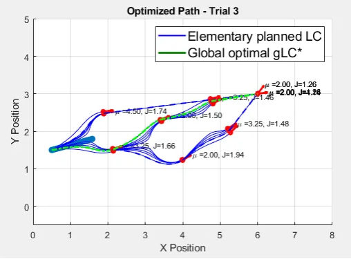

# Partie 1

# Partie  2

## Describing the main steps in long-term planification (LTP)

Pseudocode pour réaliser la planification à long-terme d'un robot mobile :
```java
BEGIN LTP

INPUT:
- Initial configuration of the robot
- Environment configuration (obstacles and target)
- Parameters for PELC (µ, Kp)

INITIALIZE:
- Graph G = (V, E) where:
            - V: Set of vertices representing robot positions around obstacles and target
            - E: Set of edges representing PELC paths between vertices
- FOREACH obstacle:
						- Calculate PELC
						- Create vertices (position along the orbit)
						- Create edges between the vertices and the target
- FOREACH edge :
						- Calculate the cost
- SEARCH
						- use Dijkstra to find the shortest path
						OR
						- use A* algorithm to find the shortest path
						return optimal path
						
END LTP
```

## Implementing and testing the algorithm

### mu opti

### Optimisation of compute-costs for long-term plannification

À des fins de plannification et d’optimisation de trajet pour un robot mobile, le programme fourni pour l’exercice utilise des cycles limites et un algorithme de calcul de graphes sous matlab afin de fournir un arbre des trajectoires possibles. Les noyaux de l’arbre sont des changements de trajectoire, des choix que le robot mobile devra entreprendre pour atteindre sa cible. Les feuilles de l’arbre sont les dernières opérations réalisées par le robot pour atteindre sa cible. Un algorithme doit parcourir l’arbre afin de déterminer quel est le parcours le moins coûteux à prendre pour le robot. Cependant, plus le trajet est long et plus l’arbre de parcours sera exponentiellement grand. La consommation en ressources et en temps des algorithmes s’en retrouve très fortement impactée, dans un but d’optimisation de ces temps de calcul, des opérations stochastiques doivent être exploitées afin de réduire la taille de l’arbre. Nous parlerons ici d’élaguage.

**Application d'opérations stochastiques**

Les opérations stochastiques peuvent prendre divers formes. Ainsi, il est possible d’élaguer des branches de l’arbre en coupant les noeux sur lesquels ils sont attachés. Cela peut se faire de manière aléatoire, où un pourcentage des noeuds de l’arbre seront effacés ou déterministe en prenant une partie de l’arbre uniquement.

Dans un premier temps, nous avons mis en place une première solution d’élaguage aléatoire de l’arbre avec un coefficient de suppriession. Concrétement, un algorithme va supprimer 10% des noyaux de l’arbre excepté la racine. On notera que lors de ses itérations, l’algorithme peut supprimer un noyau puis supprimer le noyau au dessus. L’élaguage est purement aléatoire et ne prend pas en compte la nécesssité du parcours à atteindre une feuille. Des chemins ne pouvant amener le robot à sa cible peuvent se produire et ces-derniers doivent être pris en compte lors de la plannification.

Pour éviter que l'optimisation stochastique ne "triche" en générant des chemins incomplets et donc peu couteux, nous avons ajouté une vérification pour s'assurer que les chemins atteignent bien la cible. Pour cela, l’algorithme de recherche du meilleur chemin fournit dans l’exercice $TreeProcess()$  calcule le chemin le moins couteux et si le dernier sommet du chemin n’indique pas les coordonnées de la cible, une nouvelle itération d’optimisation stochastique est réalisée. Ce méchanisme garantit que seuls les chemins complets sont pris en compte lors de la sélection du meilleur trajet.

Toutefois, l’obligation de réiterer l’optimisation stochastique étouffe les bénéfices qu’elle génère. Son application sur des arbres petits n’apporte pas de réelles améliorations, ces-dernières étant plus importantes sur un parcours plus long et un environnement plus complexe.


