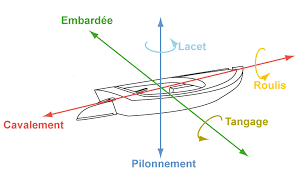
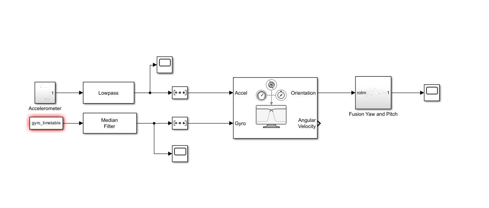
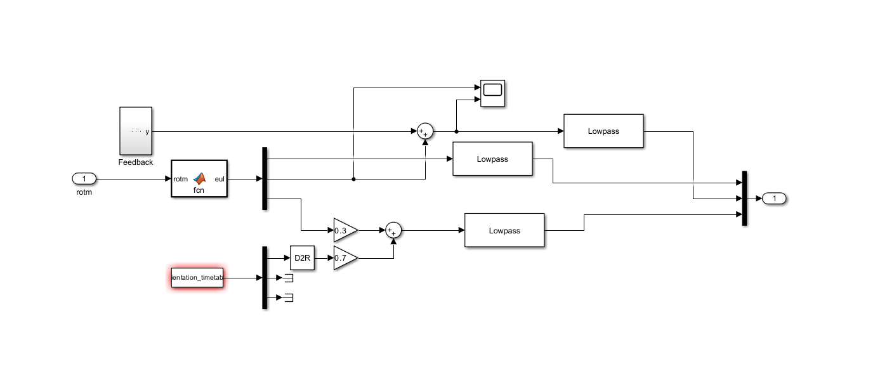
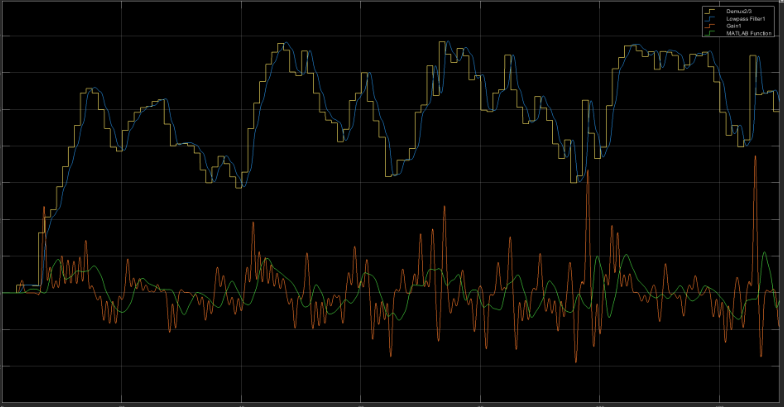

# Introduction {.unnumbered .unlisted}

Dans le cadre de cette étude, nous explorons la fusion de données issues de capteurs embarqués, en portant une attention aux erreurs d'accélération qui surviennent lors de la mesure par l'accéléromètre.

Ces erreurs d'accélération représentent une limitation des systèmes de mesure inertielle. Ce phénomène se caractérise par l'impact de l'accélération sur la réaction mesurée par l'accéléromètre, conduisant à des imprécisions dans l'estimation des mouvements. Dans notre configuration, l'utilisation de l'accéléromètre, du gyroscope et du GPS vise à mitiger ce problème.
L'installation est réalisée sur une trottinette électrique. De nature instable, il est intéréssant d'étudier la donnée obtenue afin d'observer le tangage, le roulis et l'accélération du véhicule.

La correction du roulis, liée aux erreurs d'accélération, est réalisée par l'exploitation des données de vitesse GPS. Cette stratégie permet de recaler et de stabiliser les mesures inertielles, réduisant les imprécisions induites par l'impact de l'accélération sur la réaction de l'accéléromètre.

Notre dispositif repose sur trois capteurs : un accéléromètre, un gyroscope et un récepteur GPS. L'objectif est de procéder à l'estimation des angles d'inclinaison tridimensionnels, incluant le roulis, le tangage et le lacet, tout en minimisant les erreurs d'accélération.

Le protocole de récupération des données a été conçu, s'appuyant sur l'application mobile "Physics Toolbox Suite", permettant l'enregistrement des mesures dans un fichier CSV. L'acquisition s'est déroulée sur le manche de la trottinette, offrant un environnement pour l'étude de ces erreurs d'accélération.
Les traitements des données seront effectués via Matlab. Nous mettrons en œuvre des algorithmes de correction des erreurs d'accélération. La correction du lacet, complémentaire à celle du roulis, sera réalisée par l'utilisation de l'azimut GPS, renforçant la fiabilité des mesures.

Cette approche permet une caractérisation des mouvements, en proposant une solution au défi posé par les erreurs d'accélération, ouvrant des perspectives dans la compréhension des dynamiques de déplacement.

# Solution proposée

## Exigences

### Exigences fonctionnelles :

1. La solution doit fusionner les données de trois capteurs (accéléromètre, gyroscope, données GPS)
2. La solution doit estimer les angles d'inclinaison (roulis, tangage, lacet)
3. La solution doit corriger le lacet via l'azimut GPS
4. La solution doit acquérir les données via l'application "Physics Toolbox Suite" à une fréquence de 10Hz minimum
5. La solution doit enregistrer les mesures au format CSV

### Exigences extra-fonctionnelles :

1. La solution doit fonctionner dans toutes les conditions de vitesse
2. La solution doit fonctionner dans des conditions de vibrations fortes
3. La solution doit fonctionner dans toutes les conditions de température (biais thermique intrinsèque)

## Première approche : Filtre complémentaire

### Principe théorique

Le filtre complémentaire représente une approche de fusion de données fondée sur la complémentarité des caractéristiques fréquentielles des différents capteurs. Cette méthode exploite le fait que le gyroscope fournit des mesures précises à court terme mais souffre d'une dérive à long terme due à l'intégration, tandis que l'accéléromètre offre une référence absolue stable mais bruitée.

### Formulation mathématique

L'angle estimé $\theta$ est obtenu par la combinaison pondérée de deux estimations :

$$
\theta = \alpha \cdot \theta_{gyro} + (1-\alpha) \cdot \theta_{acc}
$$

où :
- $\theta_{gyro}$ représente l'angle obtenu par intégration du gyroscope
- $\theta_{acc}$ représente l'angle calculé à partir des mesures de l'accéléromètre
- $\alpha$ est le coefficient de pondération (typiquement 0.7)

L'estimation du gyroscope est calculée par :

$$
\theta_{gyro} = \int \omega \cdot dt
$$

tandis que l'angle de l'accéléromètre est obtenu par :

$$
\theta_{acc} = \arctan(\frac{a_y}{a_x})
$$

### Limitations

Cette approche présente plusieurs limitations significatives :

1. La détermination empirique du coefficient $\alpha$ ne garantit pas une optimalité mathématique de la fusion
2. Le système est sensible aux accélérations externes qui perturbent les mesures de l'accéléromètre
3. L'intégration des données de vitesse GPS s'est avérée problématique en raison d'une fréquence d'échantillonnage insuffisante
4. La simplicité du modèle ne permet pas de prendre en compte la complexité des dynamiques non-linéaires du système

Ces limitations ont motivé l'exploration d'une approche plus sophistiquée basée sur le filtre de Kalman étendu.

## Deuxième approche : Filtre de Kalman

Pour estimer avec précision l'assiette du véhicule mobile, nous avons mis en œuvre un filtre de Kalman étendu (EKF). Cette approche permet de fusionner les données des différents capteurs tout en prenant en compte leurs incertitudes respectives.

Le filtre de Kalman que nous avons implémenté utilise un vecteur d'état à 5 dimensions comprenant la position (latitude, longitude), la vitesse (vx, vy) et le roulis. Ce choix de variables d'état nous permet de suivre à la fois la trajectoire du véhicule et son attitude.
Notre modèle d'état se base sur les équations suivantes de la cinématique :

- La position future est calculée en intégrant la vitesse actuelle : $x_{k+1} = x_k + v_k \cdot dt$
- La vitesse future est obtenue en intégrant l'accélération mesurée : $v_{k+1} = v_k + a_k \cdot dt$
- Le roulis futur est déterminé en intégrant la vitesse angulaire wx du gyroscope : $\phi_{k+1} = \phi_k + w_x \cdot dt$

La matrice jacobienne F de notre système représente la linéarisation du modèle d'état autour du point de fonctionnement courant. Elle prend en compte les relations entre les différentes variables d'état, notamment l'influence du pas de temps dt sur l'évolution position-vitesse.
Les mesures utilisées pour la correction proviennent de trois sources :

- La latitude et longitude GPS pour la position
- L'angle de roulis calculé à partir de l'accéléromètre

Le réglage des matrices de covariance Q (bruit de processus) et R (bruit de mesure) a été effectué de manière à refléter la confiance relative dans notre modèle et nos mesures. Les valeurs plus faibles (0.0001) attribuées aux positions GPS indiquent une plus grande confiance dans ces mesures, tandis que les valeurs plus élevées (0.01) pour les vitesses reflètent une plus grande incertitude sur ces estimations.
Cette implémentation permet de :

- Gérer naturellement les retards et les différentes fréquences d'échantillonnage des capteurs
- Prendre en compte les non-linéarités du système grâce à l'utilisation du filtre de Kalman étendu
- Fusionner de manière optimale les informations redondantes des différents capteurs
- Estimer les variables non directement mesurées comme la vitesse

Les résultats obtenus montrent une estimation robuste de la trajectoire et de l'attitude du véhicule, même en présence de perturbations dues aux accélérations latérales. La comparaison avec les mesures brutes des capteurs met en évidence la capacité du filtre à réduire le bruit tout en conservant la dynamique du mouvement.

# Implémentation

## Filtre Complémentaire

L'implémentation du **filtre complémentaire** sous Simulink représente une approche de fusion de données basée sur la complémentarité des capteurs. Le système s'articule autour d'une architecture de traitement en plusieurs étapes.

Une difficulté majeure rencontrée concerne la **vitesse GPS** dont la fréquence d'acquisition s'est avérée insuffisante pour une utilisation fiable dans notre système. Plusieurs tentatives d'implémentation d'une **cascade de filtres** visant à exploiter ces données de vitesse ont été entreprises, mais n'ont pas abouti à des résultats satisfaisants. Cette limitation nous a contraints à repenser notre approche de l'estimation de la vitesse.

Dans un premier temps, le **prétraitement des données** est réalisé via deux branches distinctes :

- Une branche dédiée à l'accéléromètre, où un **filtre passe-bas** atténue les composantes hautes fréquences du signal, éliminant ainsi une partie significative du bruit de mesure.
- Une branche traitant les données du gyroscope, où un **filtre médian** permet de supprimer efficacement les valeurs aberrantes tout en préservant les variations significatives.

La fusion proprement dite s'effectue ensuite selon une stratégie de **pondération complémentaire**. Les coefficients de pondération ont été déterminés empiriquement :

- Une pondération de $\alpha = 0.7$ est appliquée aux données du gyroscope, privilégiant ainsi sa précision à court terme
- Le complément $(1-\alpha) = 0.3$ est attribué aux données de l'accéléromètre, exploitant sa capacité à fournir une référence absolue



Un système de **rétroaction** a été intégré pour garantir la stabilité de l'estimation, complété par des **filtres passe-bas** en sortie assurant un lissage optimal des estimations finales.



## Filtre de Kalman Étendu (EKF)

L'implémentation du **filtre de Kalman étendu** sous MATLAB repose sur une modélisation mathématique rigoureuse du système. Comme pour le filtre complémentaire, la faible fréquence d'acquisition des données de vitesse GPS a constitué un obstacle majeur. Malgré plusieurs tentatives d'intégration via des filtres successifs, nous n'avons pas pu exploiter efficacement ces mesures de vitesse dans notre estimation d'état.

Le filtre opère sur un **vecteur d'état** à cinq dimensions :

```matlab
x = [x, y, vx, vy, roll]'
```

où `(x,y)` représente la position en coordonnées GPS, `(vx,vy)` les composantes de vitesse, et `roll` l'angle de roulis.

Le **modèle de prédiction** intègre :
- Les accélérations mesurées `gFx` et `gFy`
- La vitesse angulaire `wx` du gyroscope
- Un pas de temps `dt` dérivé de la fréquence d'échantillonnage

Les **matrices de covariance** ont été calibrées avec des valeurs standard :

```matlab
Q = diag([0.0001 0.0001 0.01 0.01 0.001])  // Bruit de processus
R = diag([0.0001 0.0001 0.01])             // Bruit de mesure
```

L'architecture logicielle s'articule autour de quatre fonctions principales :

- `f_state()` : Implémente la **transition d'état non-linéaire**
- `F_jacobian()` : Calcule la **matrice jacobienne** du modèle de transition
- `h_measure()` : Définit la **fonction d'observation**
- `H_jacobian()` : Détermine la **matrice jacobienne** du modèle d'observation

La validation du système est assurée par un ensemble de **visualisations** comprenant :

- Une représentation cartographique de la trajectoire
- L'évolution temporelle de la vitesse estimée
- Le suivi dynamique de l'angle de roulis

Cette implémentation garantit une **estimation robuste** de l'état du véhicule en fusionnant de manière optimale les données des différents capteurs, tout en prenant en compte leurs caractéristiques d'incertitude respectives.

# Conclusion {.unnumbered .unlisted}

Ce projet a permis de mettre en œuvre et d'analyser comparativement deux approches distinctes pour la **fusion de données capteurs** dans l'estimation de l'attitude d'un véhicule mobile : un **filtre complémentaire** et un **filtre de Kalman étendu** (EKF).

Le filtre complémentaire, malgré sa simplicité d'implémentation, a révélé des limitations significatives en pratique. Celles-ci incluent des **erreurs d'estimation** importantes, une forte sensibilité aux perturbations, et des résultats qui se sont avérés inexploitables. La nature empirique de la détermination de ses coefficients et son incapacité à gérer les **dynamiques non-linéaires** complexes ont finalement restreint son efficacité.

Le filtre de Kalman étendu s'est imposé comme la solution la plus performante, offrant plusieurs avantages déterminants. Il a fourni une **estimation des angles** plus précise grâce à son modèle d'estimation d'état sophistiqué, filtré efficacement les erreurs de mesure, et démontré une **robustesse** globale supérieure. La capacité de l'EKF à gérer les dynamiques non-linéaires et à fusionner de manière optimale les données de multiples capteurs s'est révélée particulièrement précieuse dans cette application.

Cependant, les deux approches ont rencontré un défi majeur concernant l'intégration de la **vitesse GPS**. La fréquence d'échantillonnage insuffisante des données GPS a empêché les corrections basées sur la vitesse, rendant impossible la correction d'attitude par GPS initialement prévue avec le matériel actuel. Cette limitation suggère que les implémentations futures bénéficieraient d'une amélioration du matériel, en particulier l'utilisation de récepteurs GPS à plus haute fréquence.


*Estimation de la vitesse*

Pour l'avenir, plusieurs axes d'amélioration ont été identifiés. La principale recommandation concerne l'intégration de **matériel GPS** à plus haute fréquence pour permettre des corrections plus efficaces basées sur la vitesse. De plus, une optimisation plus poussée des **matrices de covariance** de l'EKF pourrait potentiellement améliorer la précision des estimations, et la mise en œuvre de techniques de **filtrage adaptatif** pourrait améliorer la robustesse dans des conditions dynamiques variables.

Ce projet a démontré avec succès la faisabilité de la fusion de capteurs pour l'estimation de l'attitude d'un véhicule mobile tout en mettant en lumière des considérations importantes pour les implémentations futures dans des applications similaires. Les résultats fournissent une base solide pour le développement et l'optimisation futurs des systèmes de fusion de capteurs dans les applications mobiles.