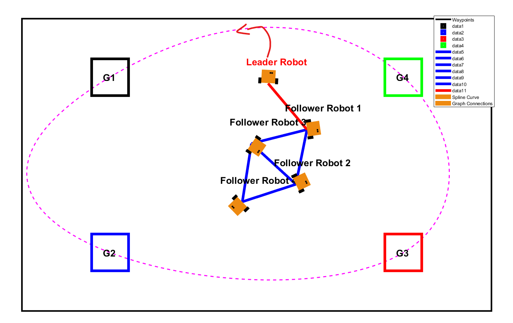

# Introduction {.unlisted .unnumbered}

# Getting Started

## Summary of the main steps of `leader_follower_save_data.m`


# Main investigations

## Planning, control and decision-making

### Proposition of a leader behaviour for smooth target transition

To address the issue of erratic navigation behavior, which imposes significant strain on real-world vehicle components, we propose two approaches aimed at achieving smoother transitions between waypoints.

**Exploring Potential Solutions**
During the exploration phase, three potential strategies emerged:

Implementing a Bézier Curve Path
The idea here was to design a circular or Bézier curve path for the robot to follow, replacing the abrupt waypoint switching in the navigation algorithm with a command law to track the curve.

Optimizing Orientation at Waypoints
Another approach involved modifying the command law to direct the robot toward the next waypoint (n+1) while already aligning its orientation for the subsequent waypoint (n+2).

### Implementing Command Law for Smooth Transition

To achieve smoother transitions between waypoints while maintaining formation integrity, we implemented a command law based on Robotarium's **automatic parking controller**. This approach considers both position and orientation simultaneously, enabling the *leader robot* to align itself with the next waypoint's orientation while approaching it.

#### Command Law Formulation 

The controller generates velocity commands based on three key components:
1. The *position error* between current pose and target waypoint
2. The *approach angle* to the target
3. The *desired final orientation* at the target

For a given waypoint ($x_t$, $y_t$, $\theta_t$), the **control inputs** are computed through two primary gains that determine the smoothness and precision of the trajectory:

- An **approach angle gain** (*k_approach*) that guides the robot's trajectory
- A **desired angle gain** (*k_desired*) that aligns the robot with the target orientation

The new parameter introduced in this command law is the target orientation $\theta_t$, which is computed as the angle between the current waypoint and the next one in the sequence. This enables the robot to prepare its orientation for the upcoming waypoint transition while still approaching the current target:

```matlab
waypoints = [-0.8 0.6 -pi/2;  // x, y, orientation
            -0.8 -0.6 0;
             0.8 -0.6 pi/2;
             0.8 0.6 pi]';
```

The controller implementation sets appropriate gains to balance smooth motion with accurate positioning:

```matlab
leader_controller = create_automatic_parking_controller(
    'ApproachAngleGain', 1.2, 
    'DesiredAngleGain', 3
);
```


A bézier curve is a parametric curve which is a set of discrete control points based of the list
of given waypoints. The idea is to create a smooth path that approaches all waypoints.


While searching on the web, we've found this sample of script that returns a bezier curve from a list of points :

```bash
function B = computeBezier(P, t)
    n = size(P, 2) - 1;
    B = zeros(2, length(t));
    for k = 1:length(t)
        B(:, k) = [0; 0];
        for i = 0:n
            B(:, k) = B(:, k) + nchoosek(n, i) * (1 - t(k)).^(n - i) * t(k).^i * P(:, i + 1);
        end
    end
end
```
By testing the Bézier curve method, we observed that the generated path was smooth but did not pass through all the designated waypoints, as shown in the following illustration:


To overcome this limitation, we shifted to a spline-based approach. Splines are mathematical functions that generate smooth paths using low-degree polynomials, ensuring that the curve passes through all waypoints.

Here's the matlab code that generate the spline :

```bash
t_points = 1:size(waypoints, 2);
t_spline = linspace(1, size(waypoints, 2), 1000);
spline_curve = spline(t_points, waypoints, t_spline);
```
The spline-based solution corrected the earlier issue, providing a path that is both smooth and passes through all waypoints:


However, the robot would stop at the last waypoint. To create a closed-loop path, the first waypoint is appended to the end of the waypoint list:

```bash
waypoints = [waypoints, waypoints(:, 1)];
```
Which finally give theses results in the following final trajectory:


**Synthetizing a command law to follow the path**

Once the spline path is defined, a command law is implemented to enable the leader robot to follow the discretized curve points. Here’s the code that enables it:

```bash
%% Make the leader travel between waypoints
    
    current_position = x(1:2, 1); % of the leader
    
    % update target ID during simulation
    if norm(current_position - spline_curve(:, index_target)) < close_enough % target offset
        if index_target < length(t_spline)
            index_target = index_target + 1; % go to next waypoint
        else
            index_target = 1; % keep moving toward the current waypoint
        end
    end
    
    % move towards the target
    dxi(:, 1) = leader_controller(current_position, target_position);

    % set the next discretized point on the curve as target
    target_position = spline_curve(:, index_target);
```

This code ensures the robot follows a smooth trajectory, as shown in the simulation screenshot below:


**Reaching the nearest point on the curve in a smooth way**

To improve convergence, the robot can first move to the nearest point on the curve before proceeding to the next target. This ensures a smoother transition and minimizes deviation from the desired path.

The solution was to compute the nearest point using :

```bash
distances = sqrt(sum((spline_curve - current_position).^2, 1));
[~, index_target] = min(distances);
```

Once the nearest point is identified, the robot is commanded to navigate to that position. After reaching the point, it resumes its normal behavior of following the curve’s discretized points to achieve all target waypoints.

This adjustment produces a smoother convergence, as illustrated here:



However, directly moving toward the nearest point in a straight line can disrupt the formation and induce strain on the leader’s trajectory. To resolve this, we propose a smoother approach that involves aligning the robot with the path's tangent before merging.

Smooth Merge Using Tangent Alignment
Instead of directly targeting the nearest point, the leader robot computes the local tangent of the spline at the nearest point and selects a target further along the tangent. This ensures a gradual and smooth alignment with the curve.

The tangent and the adjusted target point are computed as follows:

```bash
%compute tangent
dx_dt = diff(spline_curve(1, :)) ./ diff(t_spline);
dy_dt = diff(spline_curve(2, :)) ./ diff(t_spline);


if index_target < length(t_spline)
    dx = dx_dt(index_target);
    dy = dy_dt(index_target);
else
    dx = dx_dt(index_target - 1);
    dy = dy_dt(index_target - 1);
end

tangent = [dx; dy];
tangent_norm = norm(tangent);
if tangent_norm > 0
    tangent = tangent / tangent_norm;
else
    tangent = [1; 0]; % fallback
end

% adjusting the targer using tangent direction
look_ahead_distance = 1;
smooth_target = target_position + look_ahead_distance * tangent;
```

This method allows the leader to smoothly merge onto the path by following the tangent direction, resulting in a more seamless transition to the spline trajectory:


#### Using a command law to point to the next waypoint 

@Alexis it's your show there

## Adding a Fourth Follower to the Diamond Formation

To expand the symmetric diamond formation, we introduced a fourth follower positioned behind Robots 2 and 3. This required updating the underlying topology of the multi-robot system (MRS) to maintain geometric constraints and ensure a rigid structure.

```bash
N = 5
```

**Updating the Laplacian Matrix**
The diamond formation is modeled using a Laplacian matrix to define the interaction topology among the robots. With the addition of the fourth follower, the adjacency matrix A and degree matrix $D$ were updated as follows:


which gives us in matlab :

```bash
A = [0 1 0 0 0;
     1 0 1 1 0;
     0 1 0 1 1;
     0 1 1 0 1;
     0 0 1 1 2];

D = [0 0 0 0 0;
     0 3 0 0 0
     0 0 3 0 0;
     0 0 0 3 0;
     0 0 0 0 2];

L = D - A;
```

**Benefits of the Updated Topology**

<ins>Rigid Connectivity</ins>: The updated Laplacian matrix ensures the connectivity and geometric constraints of the diamond formation. It maintains symmetry and allows for cohesive movement of the formation.

<ins>Flexibility for Further Changes</ins>: The adjacency matrix structure provides a clear framework for adding more followers or modifying formations in future stages of the project.*

**Simulation Results**
The updated topology was tested in simulations, demonstrating that the geometric constraints were effectively maintained, and the added follower smoothly integrated into the diamond formation. This rigid structure will serve as the foundation for the remaining phases of the project.


## Measuring the level of precision to maintain the desired geometric formation

To measure the level of precision of the diamond formation, we suggest to compute the distance between two robots at each iteration of the simulation to verify that they maintain a similar distance through time.

**Approach**

<ins>Defining Pairs of Robots</ins>:
Based on the adjacency matrix $A$, we defined pairs of robots that should maintain fixed distances during the formation.

<ins>Distance Error Metric</ins>:
At each iteration, the distance between two robots in a pair is calculated, and the deviation from the desired distance is squared and summed for all pairs. The error metric is expressed as:


```katex
E_{distance} = \sum_{
\begin{subarray}{l}
   i,j\ \in \text{ Pairs}
\end{subarray}}(d_{ij} - d_{ij}^{ref})^2
```
with dij being the current distance between robots i and j and dij ref being the disred distance between both robots.

**Implementing in matlab**
```bash
E_distance = 0;
    for k = 1:length(distance_pairs_i)
        i = distance_pairs_i(k);
        j = distance_pairs_j(k);
        d_ij = norm(x(1:2, i) - x(1:2, j));
        E_distance = E_distance + (d_ij - desired_distance)^2;
    end
    E_distance_array(t) = E_distance;
```

**visualizing the results :**

```bash
figure;
subplot(2,1,1);
plot(1:iterations, E_distance_array, 'LineWidth', 2);
xlabel('Iteration');
ylabel('Distance Error');
title('Distance Error over Time');
```

**Results and Observations**
The plotted results indicate the distance error over time:


At the beginning of the simulation, the distance errors are high due to the robots adjusting their initial positions.
Once the formation stabilizes, the error decreases significantly and remains close to zero, confirming that the geometric formation is maintained effectively throughout the simulation.

@Justin, arrêt avant la question 3.1, il faut poursuivre sur les obstacles

# Telecommunications and Network Performance Analysis 

## Propagation Model

To effectively analyze signal propagation between agents and the antenna in our urban environment, we implemented the **Walfisch-Ikegami propagation model**. This model was selected due to its particular suitability for urban environments where path distances typically exceed **200 meters** and signal propagation is affected by multiple obstacles such as buildings and infrastructure.

### Model Architecture

The Walfisch-Ikegami model divides signal propagation into two distinct scenarios: **Line of Sight** (LOS) and **Non-Line of Sight** (NLOS). Each scenario employs different mathematical formulations to account for the specific propagation characteristics.


In Line of Sight conditions, the model augments the **Friis free space equation** with urban corrections, expressed as:

$$ L_{LOS} = 69.55 + 26.16\log_{10}(f_c) - 13.82\log_{10}(h_t) + (44.9 - 6.55\log_{10}(h_t))\log_{10}(d) $$

Where $f_c$ represents the carrier frequency in MHz, $h_t$ denotes the transmitter height in meters, and $d$ is the path distance in kilometers.

In Non-Line of Sight conditions, the total path loss is calculated as the sum of three distinct components:

$$ L_{NLOS} = L_0 + L_{rts} + L_{msd} $$

The free space loss L_0 represents the basic signal attenuation in an ideal environment and is computed as:

$$ L_0 = 32.4 + 20\log_{10}(d) + 20\log_{10}(f_c) $$

The rooftop-to-street diffraction loss $L_rts$ accounts for the signal diffraction from the last rooftop to the street level:

$$ L_{rts} = -16.9 - 10\log_{10}(w) + 10\log_{10}(f_c) + 20\log_{10}(h_m) + L_{ori} $$

Where:

- $w$ represents the street width in meters
- $h_m$ is the height difference between the building and the mobile terminal
- $L_{ori}$ is the street orientation correction factor

The multi-screen diffraction loss $L_{msd}$ models the attenuation caused by multiple diffractions over successive building rows:

$$ L_{msd} = L_{bsh} + k_a + k_d\log_{10}(d) + k_f\log_{10}(f_c) - 9\log_{10}(b) $$

Where:

- $L_{bsh}$ represents the shadowing gain for higher buildings
- $k_a$ corresponds to the increase of path loss in cases where base station antennas are below rooftops
- $k_d$ and $k_f$ are empirical coefficients representing distance and frequency dependence
- $b$ is the average building separation

This comprehensive path loss model enables accurate prediction of signal attenuation in complex urban environments, taking into account the specific characteristics of the deployment area and the relative positions of transmitters and receivers.

### Signal Quality Assessment

The received signal quality is evaluated through the **Signal-to-Noise Ratio** (SNR), calculated as:

$$ SNR = 10\log_{10}\left(\frac{P_{received}}{N_0}\right) $$

Where P_received is the received signal power and N_0 represents the **noise floor**, which we consider to be **-90 dBm** based on typical urban environment characteristics.

For transmission efficiency evaluation, the system implements **Binary Phase-Shift Keying** (BPSK) modulation. The theoretical **Bit Error Rate** (BER) for BPSK modulation is calculated using:

$$ P_{BPSK} = 0.5 \cdot (1-\sqrt{\frac{SNR}{1-SNR}}) $$

That modulation scheme was chosen because among all the modulations that can be used (BPSK, QPSK, 16-QAM, 64-QAM), BPSK is the most robust and can be used in the most challenging urban environments.

Its robustness is due to the fact that it uses only two symbols to encode the data, which makes it less sensitive to noise and interference. This is particularly important in urban environments where signal degradation can be significant due to obstacles such as buildings and infrastructure.

The different types of modulations aren't part of the scope of this project, so they will be summarized in the following image, to illustrate their sensitivities to interference and noise.


This fundamental modulation scheme was chosen for its robustness in challenging urban environments, providing reliable communication even in conditions of significant signal degradation. While more complex modulation schemes could potentially offer higher data rates, BPSK ensures consistent and dependable communication between agents and the base station. The trade-off here is between data rate and reliability, with the project prioritizing the latter to ensure seamless communication in most cases.

## Simulation and results

The class diagram for network simulation is shown below:

{ width=80% }

The simulation is run with the following parameters:

```matlab
street_width = 20; % meters
frequency = 1710; % MHz
building_height = 10; % meters
rx_height = 2; % meters
tx_height = 2; % meters
antenna_tx_height = 10; % meters
angle = 0; % degrees
in_between_building_distance = 10; % meters
emission_power_dbm = -15; % Transmission power in dBm
noise_floor_dbm = -90; % Typical noise floor
antenna_drawn = true;
```

After a full simulation, the following results were obtained:


The received power curves show the signal strength at any time, between the agents, and between the agents and the antenna. The LOS and NLOS conditions are clearly visible, with the signal strength decreasing as the distance increases. This is visible on a logarithmic scale, but is more drastic when viewed on a linear scale (like the Bit Error Rate).

We can see that the signal strength is always above the required threshold for communication, which we consider to be -110dBm (common value for a cell phone, and we do not consider the vehicle has a higher gain antenna and a lower receiver sensitivity).


What we see here, is that the Bit Error Rate, while low in LOS conditions, skyrockets in NLOS conditions. This is due to the signal being reflected and diffracted by the buildings, which causes the signal to be received with a delay, and with a lower power. This is why the Bit Error Rate is so high in NLOS conditions.


